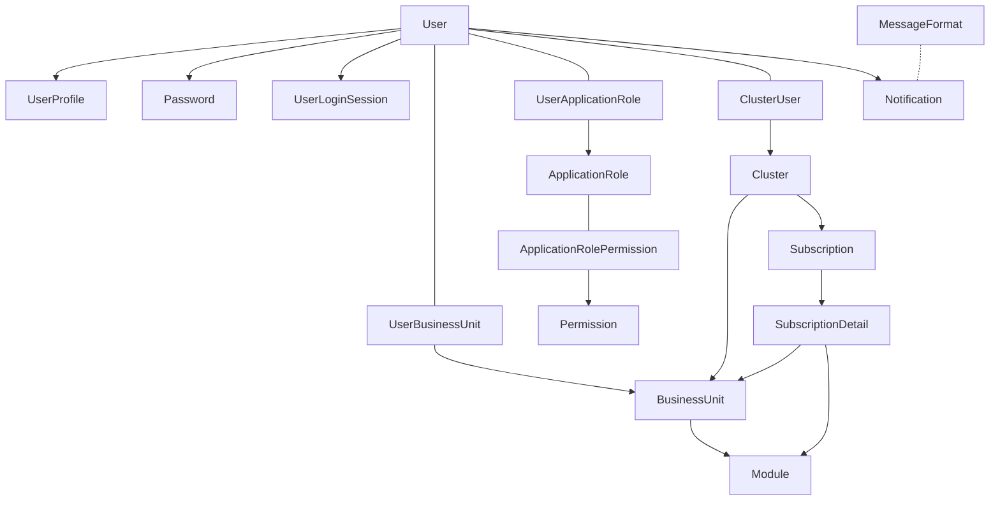

# โครงสร้างหลักของระบบ Carmen Inventory - Platform service

ระบบ **Carmen Inventory Platform Service** เป็นระบบที่มีการจัดโครงสร้างแบบลำดับชั้น โดยมีความสัมพันธ์หลักต่างๆ ดังนี้

## 1. การจัดการกลุ่มธุรกิจและการเข้าถึง

> Cluster → Business Unit (Tenant) → Module

**Cluster** คือกลุ่มธุรกิจขนาดใหญ่
**Business Unit** คือหน่วยธุรกิจย่อยภายใต้ Cluster
**Module** คือโมดูลหรือระบบย่อยที่ Business Unit สามารถเข้าถึงได้

## 2. การจัดการผู้ใช้และสิทธิ์

> User → User Profile

แต่ละ User มี User Profile เพื่อเก็บข้อมูลส่วนตัว
User เชื่อมโยงกับ Business Unit ผ่าน User-BusinessUnit
User ได้รับสิทธิ์ผ่าน Application Role

> User → Application Role → Permission

แต่ละ User สามารถมีหลาย Role
แต่ละ Role ประกอบด้วยหลาย Permission

## 3. การจัดการ Subscription

> Subscription → Subscription Detail

แต่ละ Cluster สามารถมีหลาย Subscription
Subscription Detail กำหนดว่า Business Unit ไหนสามารถเข้าถึง Module ไหนได้บ้าง

## 4. ระบบความปลอดภัย

> User → Password + User Login Session

การจัดการรหัสผ่านและ Session การเข้าสู่ระบบ

## 5. ระบบการแจ้งเตือน

> Notification → Message Format

ระบบแจ้งเตือนผู้ใช้ผ่านช่องทางต่างๆ (Email, SMS, In-App)

# diagram



```classes

    class Cluster{
        id
        code
        name
        is_active
    }
    
    class BusinessUnit{
        id
        cluster_id
        code
        name
        is_hq
        is_active
    }
    
    class Module{
        id
        name
        description
    }
    
    class User{
        id
        username
        email
        is_active
    }
    
    class UserProfile{
        id
        user_id
        firstname
        lastname
    }
    
    class ApplicationRole{
        id
        business_unit_id
        name
        description
    }
    
    class Permission{
        id
        group
        name
        description
    }
    
    class Subscription{
        id
        cluster_id
        subscription_number
        start_date
        end_date
        status
    }

```

## รายละเอียดเพิ่มเติมของแต่ละส่วน

### การจัดการผู้ใช้

- ผู้ใช้ (User) สามารถเชื่อมโยงกับหลาย Cluster ผ่าน Cluster-User
- ผู้ใช้สามารถเชื่อมโยงกับหลาย Business Unit และสามารถกำหนดบทบาท (admin/user) สำหรับแต่ละ Business Unit
- ผู้ใช้แต่ละคนมีข้อมูลส่วนตัวใน User Profile

#### ระบบสิทธิ์และการเข้าถึง

- สิทธิ์ถูกกำหนดเป็นกลุ่มผ่าน Application Role
- แต่ละ Application Role ประกอบด้วยหลาย Permission
- ผู้ใช้ได้รับสิทธิ์ผ่านการเชื่อมโยงกับ Application Role

### ระบบ Subscription

- แต่ละ Cluster มี Subscription ที่กำหนดระยะเวลาการใช้งาน
- รายละเอียด Subscription กำหนดว่า Business Unit ไหนสามารถเข้าถึง Module ไหนได้บ้าง

### การเก็บประวัติการทำงาน

- เกือบทุกตารางมีการเก็บข้อมูล created_at, created_by_id, updated_at, updated_by_id
- มีการอ้างอิงกลับไปยังตาราง User เพื่อระบุว่าใครเป็นผู้สร้างหรือแก้ไขข้อมูล
