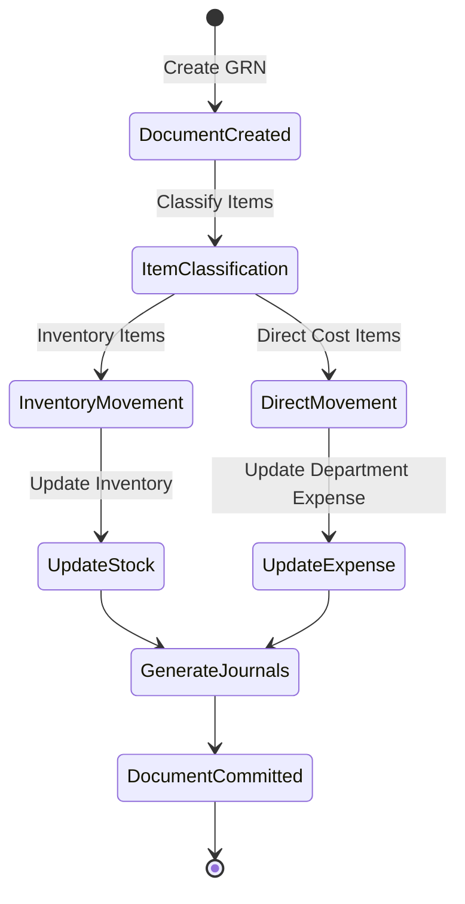

Title:
"Stock In" – Indicates that this UI deals with goods being entered into inventory.
Stock Out Transaction 
Action Buttons:
Create: This button is presumably used to create a new stock entry.
Edit: Allows for modifications to the current stock entry.
Void: This might be used to invalidate an entry, suggesting a mechanism for error correction or adjustments.
Print: Provides the functionality to print the stock entry details, likely for physical record-keeping.
Back: Allows users to return to the previous screen or dashboard.
Header Fields:
Ref: A unique reference ID  for the stock entry.
Date: The date the stock was recorded or entered.
Description: A brief description for the stock item or entry, which might denote content or relevant information for identifying the stock.
Type: Specifies the nature of the stock entry, indicating an adjustment to the inventory, possibly to correct a previous entry or update stock levels based on physical count.
Commit Date: Likely shows the date when the changes or the stock entry was finalized and committed to the system's records.
Status: Shows the current status of the entry, which helps in tracking the progress or state of the stock entry through its lifecycle in the system.


Stock In Transaction Details:
Item Details:
Store Name: RH - Rooms - Housekeeping, indicates the department or location within the store.
Item Description: Including a unique identifier (10000002) and the name (Coffee mate 450 g.).
Unit: The unit of measure for the item, in this case, Bag.
Qty: The quantity of the item to be handled in the current transaction.
Unit Cost: The cost per unit of the item.
Allow Entry/Edit 
Inventory Information
On Hand: The quantity of the item currently in stock.
On Ordered: Quantity of the item that has been ordered but not yet received.
Reorder: A flag or number indicating when it's time to reorder the item.
Restock: The quantity to be added to the inventory to restock the item.
Last Price: The most recent purchasing price of the item.
Last Vendor: The identifier for the last vendor from whom the item was purchased.
Item Information
Category: Broad classification of the item, such as "Food", "Beverage", or "Supplies", which aids in organizing inventory.
Sub Category: More specific classification within the main category, helping further refine inventory sorting and reporting.
Item Group: Groups similar items under a common label for better inventory management and analysis.
Bar Code: The barcode associated with the item, used for scanning and quick identification in inventory management systems.
Comment: A field for notes or additional information.
Stock Movement: 
Commit Date: This is the date on which the stock movement was finalized or recorded in the system.
Location: Indicates the specific store or inventory location where the stock movement occurred, helping track where inventory adjustments are made.
Item Description: Provides detailed information about the item, including an SKU number and a description. This typically includes the item name and packaging details
Inventory Unit: Specifies the unit of measurement for the inventory, such as bags, boxes, liters, etc. This helps in quantifying the stock movements accurately.
Stock In: Represents the quantity of the item that was added to the inventory. A zero in this field indicates that no new stock was added during this transaction.
Stock Out: Shows the quantity of the item that was deducted from the inventory, which is critical for tracking reductions in stock due to returns, or adjustments.
Amount: Reflects the total monetary value affected by this stock movement. This could represent the cost associated with the stock deducted or added, which is essential for financial tracking and analysis.
Reference: Contains a reference code or number that links this stock movement to related documents, such as a credit note, purchase order, or sales order. This is crucial for audit trails and reconciling financial records.


Action Buttons:
Save Button: Commits the current changes to the system.
Commit Button: Finalizes the transaction and progresses it in the inventory workflow.
Back Button: Returns the user to the previous screen without saving changes.
Fields Content:
Ref #: A unique identifier for the stock transaction.
Type: The nature of the stock transaction, such as "Adjust In".
Date: The recorded date of the stock transaction.
Status: Indicates the current state of the transaction, in this case, "Saved".
Description: Additional details regarding the stock transaction.

Action Buttons Item Edit mode:
Create Button: Likely allows the user to add a new stock item entry; its function may depend on the system’s context.
Edit Button: Initiates the editing process for the stock item details.
Delete Button: Removes the item from the stock transaction.
Save & New: Saves the current entry and clears the form for a new entry, streamlining the process for multiple entries.
Save: Commits the current entries to the database.
Cancel: Discards changes and exits the form or returns to the previous menu.

Fields Content Expanded:
Store Name: Selectable field with the store associated with the stock entry
Item Description: Detailed description of the item, including an identifier and name
Item Information 
Category/Sub Category: Classification of the item for better organization.
Item Group: Grouping based on the item's nature or usage.
Inventory Information
On Hand: The quantity of the item available in the store.
On Ordered: The quantity of the item that is on order.
Reorder: Indication of the reorder threshold for the item.
Restock: Amount needed to replenish the stock to the desired level.
Last Price: The price at which the item was last purchased.
Last Vendor: The code or name of the last vendor from whom the item was purchased.
Comment Section: Where stakeholders can add comments about the request item.
Stock Movement: 
Commit Date: This is the date on which the stock movement was finalized or recorded in the system.
Location: Indicates the specific store or inventory location where the stock movement occurred, helping track where inventory adjustments are made.
Item Description: Provides detailed information about the item, including an SKU number and a description. This typically includes the item name and packaging details
Inventory Unit: Specifies the unit of measurement for the inventory, such as bags, boxes, liters, etc. This helps in quantifying the stock movements accurately.
Stock In: Represents the quantity of the item that was added to the inventory. A zero in this field indicates that no new stock was added during this transaction.
Stock Out: Shows the quantity of the item that was deducted from the inventory, which is critical for tracking reductions in stock due to returns, or adjustments.
Amount: Reflects the total monetary value affected by this stock movement. This could represent the cost associated with the stock deducted or added, which is essential for financial tracking and analysis.
Reference: Contains a reference code or number that links this stock movement to related documents, such as a credit note, purchase order, or sales order. This is crucial for audit trails and reconciling financial records.

Footer Section
Comment Section
#: A numerical identifier for each comment made.
Date: When the comment was added.
By: Who made the comment.
Comment: The content of the comment itself.
Attachment Section
#: A numerical identifier for each attached file.
File Name: The name of the attached file.
Description: A brief description of the file.
Public: Indicates whether the file is public within the system or private.
Date: The date the file was attached.
By: The person who attached the file.
Activity Log Section
Date: When the activity took place.
By: Who performed the activity.
Action: The type of activity, such as 'Create', 'Update', 'Delete', etc.
Log: Details about the activity, possibly including additional notes or system-generated messages.


# GRN Movement Types and Logic Documentation

## 1. GRN Movement Classifications

### A. Movement Type Definitions
```
1. Inventory Movement (Stock)
   Type: MOVEMENT_INVENTORY
   Purpose: Items stored in inventory locations for later distribution
   Account Impact:
   - DR: Inventory (1140)
   - CR: Accounts Payable (2100)
   Location Type: Inventory Store

2. Direct Cost Movement (Direct)
   Type: MOVEMENT_DIRECT_COST
   Purpose: Items sent directly to consuming departments
   Account Impact:
   - DR: Department Expense (Various)
   - CR: Accounts Payable (2100)
   Location Type: Direct Cost Center
```

### B. Location Type Classifications
```typescript
enum LocationType {
  INVENTORY = 'INV',    // Inventory storage locations
  DIRECT = 'DIR'       // Direct cost centers
}

interface Location {
  code: string;
  name: string;
  type: LocationType;
  department: string;
  expenseAccount?: string;  // Required for DIRECT locations
  inventoryAccount?: string; // Required for INVENTORY locations
}

interface GRNItem {
  itemCode: string;
  description: string;
  quantity: number;
  unitCost: number;
  location: string;
  locationType: LocationType;
  movement: MovementType;
}
```

## 2. Mixed Movement Processing Logic

### A. Document Structure
```typescript
interface GRN {
  documentNo: string;
  date: string;
  supplier: string;
  status: string;
  items: GRNItem[];
  movements: Movement[];
  journalEntries: JournalEntry[];
}

interface Movement {
  type: MovementType;
  location: string;
  locationType: LocationType;
  items: {
    itemCode: string;
    quantity: number;
    unitCost: number;
    amount: number;
  }[];
}
```

### B. Processing Flow


## 3. Movement Classification Rules

### A. Item Level Rules
```
1. Location-Based Classification:
   IF location.type = INVENTORY:
      - Create inventory movement
      - Update stock balances
      - Generate inventory journal entries
   
   IF location.type = DIRECT:
      - Create direct cost movement
      - Update department expenses
      - Generate expense journal entries

2. Item Category Rules:
   - Fixed Assets → Always DIRECT
   - Consumables → Based on location
   - Stock Items → Based on location
   - Services → Always DIRECT
```

### B. Document Handling
```sql
-- Split movements by type
CREATE PROCEDURE ProcessGRNMovements
    @GRNNo VARCHAR(20)
AS
BEGIN
    -- Process Inventory Movements
    INSERT INTO Movements (
        Type, Location, ItemCode, Quantity,
        UnitCost, Amount, Reference
    )
    SELECT 
        'INVENTORY', i.Location, i.ItemCode,
        i.Quantity, i.UnitCost, 
        i.Quantity * i.UnitCost,
        @GRNNo
    FROM GRNItems i
    JOIN Locations l ON i.Location = l.Code
    WHERE l.Type = 'INV';

    -- Process Direct Movements
    INSERT INTO Movements (
        Type, Location, ItemCode, Quantity,
        UnitCost, Amount, Reference
    )
    SELECT 
        'DIRECT', i.Location, i.ItemCode,
        i.Quantity, i.UnitCost,
        i.Quantity * i.UnitCost,
        @GRNNo
    FROM GRNItems i
    JOIN Locations l ON i.Location = l.Code
    WHERE l.Type = 'DIR';
END
```

## 4. Journal Entry Generation

### A. Mixed Journal Structure
```sql
-- Generate multiple journal entries based on movement type
CREATE PROCEDURE GenerateGRNJournals
    @GRNNo VARCHAR(20)
AS
BEGIN
    -- Inventory Movements
    INSERT INTO JournalEntries (
        AccountCode, AccountName, Department,
        Debit, Credit, Reference
    )
    SELECT 
        l.InventoryAccount,
        'Inventory',
        l.Department,
        SUM(i.Quantity * i.UnitCost),
        0,
        @GRNNo
    FROM GRNItems i
    JOIN Locations l ON i.Location = l.Code
    WHERE l.Type = 'INV'
    GROUP BY l.InventoryAccount, l.Department;

    -- Direct Cost Movements
    INSERT INTO JournalEntries (
        AccountCode, AccountName, Department,
        Debit, Credit, Reference
    )
    SELECT 
        l.ExpenseAccount,
        'Department Expense',
        l.Department,
        SUM(i.Quantity * i.UnitCost),
        0,
        @GRNNo
    FROM GRNItems i
    JOIN Locations l ON i.Location = l.Code
    WHERE l.Type = 'DIR'
    GROUP BY l.ExpenseAccount, l.Department;

    -- Accounts Payable Entry (Combined)
    INSERT INTO JournalEntries (
        AccountCode, AccountName, Department,
        Debit, Credit, Reference
    )
    SELECT 
        '2100',
        'Accounts Payable',
        'FIN',
        0,
        SUM(Quantity * UnitCost),
        @GRNNo
    FROM GRNItems;
END
```

### B. Sample Journal Entries
```
Example GRN with Mixed Movements:

1. Inventory Items:
DR Inventory (1140)           5,000
   Department: Warehouse

2. Direct Cost Items:
DR Kitchen Expense (5110)     2,000
   Department: F&B
DR Room Supplies (5120)       3,000
   Department: Housekeeping

CR Accounts Payable (2100)    10,000
   Department: Finance
```

## 5. Movement Validation Rules

### A. Common Validations
```
1. Document Level:
   - Single supplier per GRN
   - Valid posting date
   - Authorized requestor
   - Budget availability

2. Item Level:
   - Valid item for location type
   - Valid cost center for direct items
   - Authorized quantity limits
   - Price variance thresholds
```

### B. Type-Specific Validations
```
1. Inventory Movements:
   - Storage location availability
   - Bin assignment required
   - Batch tracking if applicable
   - Quality check requirements

2. Direct Movements:
   - Department budget check
   - Authorization limits
   - Asset categorization
   - Cost center validation
```

## 6. Reporting Requirements

### A. Document Level Reports
```
1. GRN Summary:
   - Total by movement type
   - Location breakdown
   - Department totals
   - Account distribution

2. Audit Reports:
   - Mixed movement tracking
   - Cost allocation details
   - Authorization trail
   - Budget impact analysis
```

### B. Movement Analysis
```
1. Movement Type Distribution:
   - Ratio of direct vs inventory
   - Cost center analysis
   - Budget vs actual by type
   - Trend analysis

2. Location Analysis:
   - Movement patterns
   - Storage utilization
   - Direct delivery patterns
   - Cost center consumption
```

Would you like me to:
1. Add more validation rules?
2. Expand the journal entry scenarios?
3. Add more movement type classifications?
4. Include additional processing rules?
5. Detail the reporting requirements further?
6. Add system configuration options?