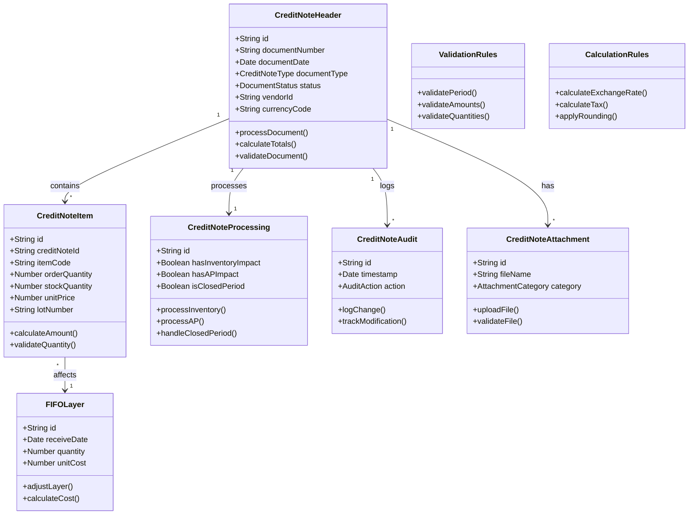

## Table of Contents

1. Module Overview
2. Key Features
3. Detailed Specifications
4. Use Cases
5. Required Screens
6. Additional Considerations
7. Closed Period Adjustment Process
8. System Configuration for Closed Period Handling

## 1. Module Overview

The Credit Note Module is designed to handle vendor returns and discounts within an inventory system integrated with an AP module. It supports multi-currency transactions, tracks order units and inventory units conversions, and handles various scenarios of returns and discounts, including cases with insufficient inventory and transactions affecting closed periods.

## 2. Key Features

- Multi-currency support for all transactions
- Order units and inventory units conversion tracking
- Integration with Good Receiving Notes (GRN) and AP module
- FIFO (First-In, First-Out) cost calculation and inventory valuation
- Lot number tracking and partial lot returns
- Handling of returns with insufficient inventory through direct AP credit notes
- Comprehensive audit trail and reporting
- Management of transactions affecting closed accounting periods

## 3. Detailed Specifications

### 3.1 Multi-Currency Management

- Maintain exchange rates for all relevant currencies
- Allow for daily/periodic updates of exchange rates
- Provide options for handling exchange rate differences
- Generate reports on currency exposure and impact on returns/credits

### 3.2 Unit Conversion

- Maintain conversion factors between order units and inventory units
- Automatically convert units during return process
- Track both original order units and inventory units for each transaction

### 3.3 GRN Integration

- Reference GRN number, date of receipt, item details, PO number, and lot number(s)
- Include currency of original transaction and exchange rate

### 3.4 Inventory Adjustments

- Update inventory levels and costs by lot when processing returns
- Adjust FIFO layers when returns are processed
- Handle cost adjustments in multiple currencies

### 3.5 AP Module Integration

- Adjust for lot-specific costs in credit calculations
- Handle currency conversions for AP adjustments
- Create direct AP credit notes for returns with insufficient inventory

### 3.6 Tax Handling

- Automatically calculate tax credit based on original tax charged
- Adjust for partial returns or when tax rates have changed
- Account for lot-specific tax considerations
- Credit the Input VAT report transaction
- Handle tax calculations and credits in multiple currencies

### 3.7 Audit Trail

- Log all actions related to returns and credits
- Include user ID, timestamp, and action details
- Track lot numbers in all transactions for complete traceability
- Record currency and exchange rate information for each transaction
- Log unit conversions between order and inventory units

### 3.8 Reporting

- Vendor Return Summary (with multi-currency support)
- Credit Note Aging (in base and foreign currencies)
- Return Reason Analysis
- Impact on Inventory Valuation (considering multiple currencies)
- Lot-specific return analysis
- FIFO cost adjustment report (with currency conversion details)
- Currency fluctuation impact report
- Unit conversion report
- Direct AP credit note report
- Closed period adjustment reports

## 4. Use Cases

### 4.1 Return Product (QTY)

### 4.1.1 Remain in Full

- Scenario: The entire quantity of a product from a specific lot is being returned.
- System Actions:
    - Reverse the entire inventory transaction for the lot.
    - Update FIFO layers to reflect the full return.
    - Adjust the inventory quantity to zero for this lot.
    - Generate a full credit note for the original purchase amount.

### 4.1.2 No Remaining Qty. of That Lot but Still Need to Return to Vendor

- Scenario: The lot has been fully consumed or sold, but a return to the vendor is still required.
- System Actions:
    - Create a direct AP credit note without affecting current inventory levels.
    - Flag this as an AP adjustment case in the audit trail.
    - Do not create any inventory adjustments.
    - Update financial records to reflect the credit without inventory impact.

### 4.1.3 Partial Remaining QTY.

- Scenario: Only a portion of the original lot quantity is being returned.
- System Actions:
    - Update inventory levels for the specific lot, reducing by the available returned quantity.
    - Adjust FIFO layers partially, maintaining the cost structure for the unreturned portion.
    - Generate a credit note for the returned portion.
    - For any quantity not available in inventory:
        - Create a direct AP credit note for the remaining value.
        - Flag this portion as an AP adjustment in the audit trail.
    - Update average costs considering the partial return.

### 4.1.4 Partial Remaining QTY on Other Locations

- Scenario: The return quantity is available, but spread across multiple storage locations.
- System Actions:
    - Identify all locations where the lot is stored.
    - Allow user to select which locations to pull the return from.
    - Update inventory levels across multiple locations as needed.
    - For any quantity not available across all locations:
        - Create a direct AP credit note for the remaining value.
        - Flag this portion as an AP adjustment in the audit trail.
    - Adjust FIFO layers considering multi-location impact and AP adjustments.
    - Generate a credit note reflecting the total returned quantity across locations and any AP adjustments.

### 4.2 Discount

### 4.2.1 Remain in Full

- Scenario: A discount is applied to a full lot that is still entirely in inventory.
- System Actions:
    - Create a credit note for the discount amount without changing inventory quantity.
    - Adjust the cost of the entire lot in the FIFO layers.
    - Update average cost calculations for the item.
    - Reflect the discount in future inventory valuations.

### 4.2.2 No Remaining Qty.

- Scenario: A discount is applied to a lot that has been fully consumed or sold.
- System Actions:
    - Generate a credit note for the discount amount.
    - Adjust historical FIFO layers to reflect the discount.
    - Update cost of goods sold for the period if applicable.
    - Flag this as a retrospective adjustment in financial reports.

### 4.2.3 Partial Remaining QTY.

- Scenario: A discount is applied to a lot that is partially remaining in inventory.
- System Actions:
    - Create a credit note for the full discount amount.
    - Adjust FIFO layers for the remaining quantity.
    - Potentially split the discount between inventory adjustment and cost of goods sold.
    - Update average costs for the remaining inventory.

### 4.2.4 Partial Remaining QTY on Other Locations

- Scenario: A discount is applied to a lot that is partially remaining but spread across locations.
- System Actions:
    - Generate a credit note for the full discount amount.
    - Adjust FIFO layers across all relevant locations.
    - Update inventory valuations for each affected location.
    - Provide a breakdown of the discount application across locations.

### 4.3 Mixed Inventory and AP Credit Note

- Scenario: A return request is made for a quantity that partially exceeds available inventory.
- System Actions:
    - Identify available inventory across all relevant locations.
    - Process an inventory return for the available quantity:
        - Update inventory levels.
        - Adjust FIFO layers.
        - Generate an inventory-based credit note portion.
    - For the quantity exceeding available inventory:
        - Create a direct AP credit note.
        - Flag this portion as an AP adjustment.
    - Generate a single credit note document that clearly separates:
        - The inventory return portion.
        - The direct AP credit portion.
    - Update all relevant financial records and reports to reflect this split transaction.

### 4.4 Transactions Over Closed Periods

- Scenario: A credit note needs to be issued for a transaction that occurred in a closed accounting period.
- System Actions:
    - Allow creation of the credit note with a current date.
    - Link the credit note to the original transaction in the closed period.
    - Create appropriate adjusting entries in the current open period.
    - For inventory returns:
        - If the inventory period is open but the financial period is closed, allow inventory adjustments but create financial entries in the current period.
        - If both inventory and financial periods are closed, create adjustment entries in the current period for both inventory and financials.
    - For discounts:
        - Create adjusting entries in the current period, referencing the original transaction.
    - Generate reports showing the impact on historical and current period financials.
    - Require additional approval for transactions affecting closed periods.

## 5. Required Screens

### 5.1 Credit Note List Screen

- Purpose: Overview of all credit notes
- Key Elements:
    - List of credit notes with columns: Credit Note Number, Date, Vendor, Total Amount, Currency, Status
    - Filters for date range, vendor, status, and currency
    - Search functionality
    - "Create New Credit Note" button
    - Options to view, edit, or delete credit notes

### 5.2 Create/Edit Credit Note Screen

- Purpose: Create a new credit note or edit an existing one
- Key Elements:
    - Credit Note Number
    - Credit Note Date picker
    - Vendor selection (with search functionality)
    - GRN reference number (with lookup functionality)
    - Invoice Number
    - Invoice Date
    - Tax Invoice Number
    - Tax Invoice Date
    - Currency selection (with current exchange rate display)
    - Reason for credit note (dropdown)
    - Comments/Notes field
    - Table for item entry:
        - Product Name (with search/lookup)
        - Description
        - Lot Number (with lookup)
        - Quantity in Order Units
        - Quantity in Inventory Units
        - Unit Price
        - Discount
        - Tax
        - Total
        - Applied Lot Number
        - Applied Location
    - Subtotal, Tax Total, and Grand Total (in selected currency and base currency)
    - Section showing:
        - Requested return quantity
        - Available inventory quantity
        - Quantity to be processed as inventory return
        - Quantity to be processed as direct AP credit
    - Clear visual distinction between inventory return and AP credit portions
    - Fields for AP credit justification when applicable
    - "Save Draft" and "Submit" buttons

### 5.3 GRN Lookup Screen

- Purpose: Select the GRN to reference for the credit note
- Key Elements:
    - List of GRNs with columns: GRN Number, Date, Vendor, Total Amount, Currency
    - Filters for date range and vendor
    - Search functionality
    - Option to select full GRN or specific items

### 5.4 Lot Number Details Screen

- Purpose: View and select specific lot numbers for return
- Key Elements:
    - GRN Number and Item SKU reference
    - List of available lot numbers with columns: Lot Number, Receive Date, Quantity, Expiry Date
    - Option to select full or partial quantity from each lot
    - Unit conversion display (Order Units to Inventory Units)

### 5.5 Credit Note Approval Screen

- Purpose: Review and approve credit notes
- Key Elements:
    - Credit note details (read-only)
    - Comparison with original GRN/Invoice
    - Approval action buttons (Approve, Reject, Request Changes)
    - Comments field for approver
    - Clear display of inventory return vs. AP credit portions
    - Additional approval steps for cases involving direct AP credits

### 5.6 Inventory Adjustment Preview Screen

- Purpose: Show the impact of the credit note on inventory
- Key Elements:
    - Table showing affected SKUs, lot numbers, current quantity, adjustment quantity, and new quantity
    - FIFO layer adjustment preview
    - Cost impact summary (in multiple currencies)
    - Note about any quantity processed as direct AP credit

### 5.7 AP Credit Note Preview Screen

- Purpose: Show details of direct AP credit portions
- Key Elements:
    - Display details of the portion being processed as a direct AP credit
    - Show impact on AP account balances
    - Provide fields for additional AP adjustment notes or justifications

### 5.8 Multi-Currency Configuration Screen

- Purpose: Manage currency settings
- Key Elements:
    - List of active currencies
    - Exchange rate update frequency settings
    - Manual exchange rate entry option
    - Currency rounding rules
    - Base currency selection

### 5.9 Unit Conversion Configuration Screen

- Purpose: Manage unit conversion settings
- Key Elements:
    - List of SKUs with order unit and inventory unit
    - Conversion factor entry/edit for each SKU
    - Bulk update options
    - Default unit settings

### 5.10 Credit Note Report Generation Screen

- Purpose: Generate various reports related to credit notes
- Key Elements:
    - Report type selection (e.g., Vendor Return Summary, Credit Note Aging, FIFO Valuation Impact)
    - Date range selection
    - Vendor filter
    - Currency selection for report
    - Additional filters based on report type
    - Preview and Export options
    - Options to view splits between inventory and AP credit portions

### 5.11 Audit Trail Viewer

- Purpose: View detailed audit trail for credit notes
- Key Elements:
    - Credit note selection
    - Chronological list of all actions taken on the credit note
    - Details including user, timestamp, action type, and before/after values
    - Filters for action type and date range
    - Clear distinction between actions affecting inventory and those affecting AP directly

### 5.12 Dashboard

- Purpose: Provide an overview of credit note activity and key metrics
- Key Elements:
    - Summary statistics (e.g., total credits this month, average processing time)
    - Charts/graphs (e.g., credits by reason, credits by vendor)
    - Currency exposure summary
    - Recent activity feed
    - Quick links to common actions (e.g., create new credit note, approve pending credits)
    - Breakdown of inventory returns vs. direct AP credits

### 5.13 Closed Period Transaction Screen

- Purpose: Handle credit notes for transactions in closed periods
- Key Elements:
    - Selection of original transaction from closed period
    - Current date for credit note
    - Clear display of which periods (inventory and/or financial) are affected
    - Options for handling adjustments (e.g., all in current period, split between periods if allowed)
    - Warning messages about impact on closed period reporting
    - Additional approval workflow triggers
    - Audit trail entries specific to closed period adjustments

## 6. Additional Considerations

- Approval Workflows: Implement appropriate approval processes, especially for cases involving direct AP credit notes due to insufficient inventory.
- Multi-Currency Handling: Ensure all actions account for potential currency differences between original transaction and credit note.
- Unit Conversion: Handle any necessary conversions between order units and inventory units consistently across all scenarios.
- Audit Trail: Maintain a detailed audit trail for each action taken in these scenarios, distinguishing between inventory adjustments and AP adjustments.
- Reporting Impact: Update all relevant reports to accurately reflect the various scenarios, including splits between inventory returns and direct AP credit notes.
- Integration: Ensure seamless integration with existing inventory management and AP systems.
- User Training: Develop comprehensive training materials to educate users on the new functionalities, especially regarding the handling of insufficient inventory scenarios.
- System Performance: Optimize database queries and calculations to handle complex scenarios efficiently, especially for large volumes of transactions.
- Data Migration: Plan for data migration strategies if updating from an existing system, ensuring historical credit notes are accurately represented in the new system.
- Closed Period Handling:
    - Implement strict controls and approvals for adjustments affecting closed periods.
    - Ensure the system can generate appropriate adjusting entries in the current period while maintaining a clear audit trail back to the original transaction.
    - Develop reports that clearly show the impact of these adjustments on both historical and current period financials.
    - Consider regulatory and audit requirements when designing the closed period adjustment process.
- Reporting Enhancements:
    - Create specific reports for tracking adjustments made to closed periods.
    - Ensure financial statements can be regenerated with and without closed period adjustments for comparison.
- System Flexibility:
    - Allow configuration of rules for handling closed period transactions (e.g., strictly prevent, allow with approval, allow within certain timeframes).
- User Permissions:
    - Implement specific user roles and permissions for handling closed period adjustments.
- Training and Documentation:
    - Provide detailed training on the implications and proper handling of closed period adjustments.
    - Develop clear procedures for when and how to process credit notes affecting closed periods.

## 7. Closed Period Adjustment Process

### 7.1 Identification

- System identifies if the credit note affects a closed accounting or inventory period.

### 7.2 Validation

- Checks are performed to ensure the adjustment is allowable based on company policies and system settings.

### 7.3 Approval Workflow

- Initiates a special approval process for closed period adjustments.
- Requires higher-level authorization (e.g., CFO, Controller).

### 7.4 Adjustment Creation

- Creates adjusting entries in the current open period.
- Maintains clear references to the original transaction in the closed period.

# Credit Note Module Schema

## 1. Header (CreditNoteHeader)

```tsx
interface CreditNoteHeader {
  id: string;                    // Unique identifier for credit note
  documentNumber: string;        // System generated credit note number
  documentDate: Date;           // Credit note date
  postingDate: Date;            // Accounting posting date
  documentType: CreditNoteType; // Type of credit note
  status: DocumentStatus;       // Current document status
  branchId: string;             // Branch identifier

  // Vendor Information
  vendorId: string;             // Vendor identifier
  vendorCode: string;           // Vendor code
  vendorName: string;           // Vendor name
  vendorTaxId: string;          // Vendor tax ID

  // Tax Information
  taxInvoiceNumber: string;     // Reference tax invoice number
  taxInvoiceDate: Date;         // Tax invoice date
  vatRate: number;              // VAT percentage
  whtRate: number;              // Withholding tax percentage

  // Currency Information
  currencyCode: string;         // Transaction currency
  exchangeRate: number;         // Exchange rate to base currency
  exchangeRateDate: Date;       // Rate date

  // Reference Information
  referenceNumber: string;      // External reference number
  departmentId: string;         // Department identifier
  reason: string;              // Credit note reason
  remarks: string;             // Additional remarks

  // Period Information
  accountingPeriod: string;     // Accounting period (YYYYMM)
  taxPeriod: string;           // Tax period (YYYYMM)

  // System Fields
  createdBy: string;           // User who created
  createdDate: Date;           // Creation timestamp
  modifiedBy: string;          // Last modified by
  modifiedDate: Date;          // Last modified timestamp
  approvedBy: string;          // Approver
  approvedDate: Date;          // Approval timestamp
}

enum CreditNoteType {
  RETURN = 'RETURN',
  DISCOUNT = 'DISCOUNT',
  COMPENSATION = 'COMPENSATION'
}

enum DocumentStatus {
  DRAFT = 'DRAFT',
  SUBMITTED = 'SUBMITTED',
  PENDING_APPROVAL = 'PENDING_APPROVAL',
  APPROVED = 'APPROVED',
  POSTED = 'POSTED',
  CANCELLED = 'CANCELLED'
}

```

## 2. Items (CreditNoteItem)

```tsx
interface CreditNoteItem {
  id: string;                   // Unique identifier for item
  creditNoteId: string;         // Reference to header
  lineNumber: number;           // Line sequence number

  // Item Information
  itemCode: string;             // Item code
  itemDescription: string;      // Item description
  itemType: ItemType;           // Type of item

  // Quantity and Units
  orderUnitCode: string;        // Order unit of measure
  orderQuantity: number;        // Quantity in order units
  stockUnitCode: string;        // Stock unit of measure
  stockQuantity: number;        // Quantity in stock units
  unitConversion: number;       // Conversion factor

  // Pricing
  unitPrice: number;            // Unit price in document currency
  amount: number;               // Total amount (quantity × price)
  discountPercent: number;      // Discount percentage
  discountAmount: number;       // Discount amount
  netAmount: number;            // Net amount after discount

  // Tax Amounts
  vatAmount: number;            // VAT amount
  whtAmount: number;            // WHT amount

  // Local Currency Amounts
  localUnitPrice: number;       // Unit price in local currency
  localAmount: number;          // Total amount in local currency
  localNetAmount: number;       // Net amount in local currency

  // Lot/FIFO Information
  lotNumber: string;            // Lot number (for regular returns)
  fifoLayer: FIFOLayer;         // FIFO layer details
  warehouseCode: string;        // Warehouse location

  // NBCA Information
  isNBCA: boolean;              // NBCA flag
  nbcaReference: string;        // Reference for NBCA items

  // Original Document Reference
  originalGRNNumber: string;    // Original GRN reference
  originalGRNDate: Date;        // Original GRN date
  originalInvoiceNumber: string; // Original invoice reference

  // Cost Information
  originalCost: number;         // Original cost
  currentCost: number;          // Current cost
  costVariance: number;         // Cost variance
}

interface FIFOLayer {
  id: string;                   // Layer identifier
  receiveDate: Date;            // Receipt date
  quantity: number;             // Layer quantity
  unitCost: number;             // Unit cost
  totalCost: number;            // Total cost
  remainingQuantity: number;    // Available quantity
}

enum ItemType {
  INVENTORY = 'INVENTORY',
  SERVICE = 'SERVICE',
  NON_INVENTORY = 'NON_INVENTORY'
}

```

## 3. Processing Details

```tsx
interface CreditNoteProcessing {
  id: string;                   // Processing identifier
  creditNoteId: string;         // Reference to header

  // Inventory Impact
  hasInventoryImpact: boolean;  // Affects inventory
  inventoryPostingDate: Date;   // Inventory posting date
  inventoryPeriod: string;      // Inventory period

  // AP Impact
  hasAPImpact: boolean;         // Affects AP
  apPostingDate: Date;          // AP posting date
  apPeriod: string;            // AP period

  // Tax Impact
  hasTaxImpact: boolean;        // Affects tax reports
  taxPostingDate: Date;         // Tax posting date
  vatPeriod: string;           // VAT period

  // Period Processing
  isClosedPeriod: boolean;      // Closed period flag
  adjustmentPeriod: string;     // Adjustment period
  requiresSpecialApproval: boolean; // Special approval flag
}

```

## 4. Audit Trail

```tsx
interface CreditNoteAudit {
  id: string;                   // Audit entry identifier
  creditNoteId: string;         // Reference to header
  timestamp: Date;              // Action timestamp
  action: AuditAction;          // Type of action
  userId: string;               // User who performed action
  oldValues: Record<string, any>; // Previous values
  newValues: Record<string, any>; // New values
  remarks: string;              // Audit remarks
}

enum AuditAction {
  CREATED = 'CREATED',
  MODIFIED = 'MODIFIED',
  APPROVED = 'APPROVED',
  POSTED = 'POSTED',
  CANCELLED = 'CANCELLED'
}

```

## 5. Attachments

```tsx
interface CreditNoteAttachment {
  id: string;                   // Attachment identifier
  creditNoteId: string;         // Reference to header
  fileName: string;             // Original file name
  fileType: string;             // File MIME type
  fileSize: number;             // File size in bytes
  uploadDate: Date;             // Upload timestamp
  uploadedBy: string;           // User who uploaded
  description: string;          // Attachment description
  category: AttachmentCategory; // Attachment category
}

enum AttachmentCategory {
  TAX_INVOICE = 'TAX_INVOICE',
  SUPPORTING_DOC = 'SUPPORTING_DOC',
  APPROVAL_DOC = 'APPROVAL_DOC',
  OTHER = 'OTHER'
}

```

## 6. Validation Rules

```tsx
interface ValidationRules {
  // Header Validation
  documentDate: {
    notFuture: boolean;         // Cannot be future date
    notBeforeGRN: boolean;      // Cannot be before GRN date
  };

  // Amount Validation
  amounts: {
    minimumAmount: number;      // Minimum allowed amount
    maximumAmount: number;      // Maximum allowed amount
    requireApproval: number;    // Threshold for approval
  };

  // Quantity Validation
  quantity: {
    notExceedOriginal: boolean; // Cannot exceed original
    allowPartial: boolean;      // Allow partial returns
    minimumQuantity: number;    // Minimum quantity
  };

  // Period Validation
  period: {
    allowClosedPeriod: boolean; // Allow closed period
    maxPeriodDifference: number; // Maximum months back
  };
}

```

## 7. Calculation Rules

```tsx
interface CalculationRules {
  // Amount Calculations
  amounts: {
    roundingDecimal: number;    // Decimal places
    roundingMethod: RoundingMethod; // Rounding method
  };

  // Exchange Rate
  exchangeRate: {
    allowOverride: boolean;     // Allow manual override
    varianceLimit: number;      // Maximum variance %
  };

  // Tax Calculations
  tax: {
    vatInclusive: boolean;      // VAT inclusive pricing
    allowManualAdjustment: boolean; // Allow tax adjustment
  };
}

enum RoundingMethod {
  ROUND_UP = 'ROUND_UP',
  ROUND_DOWN = 'ROUND_DOWN',
  ROUND_HALF_UP = 'ROUND_HALF_UP'
}

```

This schema provides:

1. Clear Type Definitions:
    - All required fields and their types
    - Proper enumerations for status and categories
    - Comprehensive interface definitions
2. Relationships:
    - Header to items relationship
    - Processing details linkage
    - Audit trail connections
    - Attachment associations
3. Business Rules:
    - Validation rules
    - Calculation methods
    - Processing requirements
    - Period handling
4. Audit and Control:
    - Complete audit trail
    - Document attachments
    - System fields
    - Version control

