# Carmen Inventory System Database
> Generated by [`prisma-markdown`](https://github.com/samchon/prisma-markdown)

- [default](#default)

## default

```mermaid
erDiagram
"tb_application_role" {
  String id PK
  String business_unit_id FK
  String name UK
  String description "nullable"
  DateTime created_at "nullable"
  String created_by_id FK "nullable"
  DateTime updated_at "nullable"
  String updated_by_id FK "nullable"
}
"tb_application_role_tb_permission" {
  String id PK
  String application_role_id FK
  String permission_id FK
  DateTime created_at "nullable"
  String created_by_id FK "nullable"
  DateTime updated_at "nullable"
  String updated_by_id FK "nullable"
}
"tb_business_unit" {
  String id PK
  String cluster_id FK
  String code
  String name
  String description "nullable"
  Boolean is_hq "nullable"
  Boolean is_active "nullable"
  String db_connection "nullable"
  DateTime created_at "nullable"
  String created_by_id FK "nullable"
  DateTime updated_at "nullable"
  String updated_by_id FK "nullable"
}
"tb_business_unit_tb_module" {
  String id PK
  String business_unit_id FK
  String module_id FK
  DateTime created_at "nullable"
  String created_by_id FK "nullable"
  DateTime updated_at "nullable"
  String updated_by_id FK "nullable"
}
"tb_cluster" {
  String id PK
  String code UK
  String name UK
  Boolean is_active "nullable"
  Json info "nullable"
  DateTime created_at "nullable"
  String created_by_id FK "nullable"
  DateTime updated_at "nullable"
  String updated_by_id FK "nullable"
}
"tb_cluster_user" {
  String id PK
  String user_id FK "nullable"
  String cluster_id FK
  Boolean is_active "nullable"
  enum_cluster_user_role role
  DateTime created_at "nullable"
  String created_by_id FK "nullable"
  DateTime updated_at "nullable"
  String updated_by_id FK "nullable"
}
"tb_currency_iso" {
  String id PK
  String iso_code UK
  String name
  String symbol
}
"tb_message_format" {
  String id PK
  String name UK
  String message "nullable"
  Boolean is_email
  Boolean is_sms "nullable"
  Boolean is_in_app "nullable"
  DateTime created_at "nullable"
  String created_by_id FK "nullable"
  DateTime updated_at "nullable"
  String updated_by_id FK "nullable"
}
"tb_module" {
  String id PK
  String name UK
  String description "nullable"
  DateTime created_at "nullable"
  String created_by_id FK "nullable"
  DateTime updated_at "nullable"
  String updated_by_id FK "nullable"
}
"tb_notification" {
  String id PK
  String from_user_id FK
  String to_user_id FK
  String message "nullable"
  Boolean is_read "nullable"
  Boolean is_sent "nullable"
  DateTime created_at "nullable"
  String created_by_id FK "nullable"
  DateTime updated_at "nullable"
  String updated_by_id FK "nullable"
}
"tb_password" {
  String id PK
  String user_id FK
  String hash
  Boolean is_active "nullable"
  DateTime expired_on
  DateTime created_at "nullable"
  String created_by_id FK "nullable"
}
"tb_permission" {
  String id PK
  String group
  String name
  String description "nullable"
  DateTime created_at "nullable"
  String created_by_id FK "nullable"
  DateTime updated_at "nullable"
  String updated_by_id FK "nullable"
}
"tb_subscription" {
  String id PK
  String cluster_id FK
  String subscription_number
  DateTime start_date
  DateTime end_date
  enum_subscription_status status
  DateTime created_at "nullable"
  String created_by_id FK "nullable"
  DateTime updated_at "nullable"
  String updated_by_id FK "nullable"
}
"tb_subscription_detail" {
  String id PK
  String subscription_id FK
  String business_unit_id FK
  String module_id FK
  DateTime created_at "nullable"
  String created_by_id FK "nullable"
  DateTime updated_at "nullable"
  String updated_by_id FK "nullable"
}
"tb_user" {
  String id PK
  String username UK
  String email
  enum_platform_role platform_role
  Boolean is_active "nullable"
  Boolean is_consent "nullable"
  DateTime consent_at "nullable"
  DateTime created_at "nullable"
  String created_by_id FK "nullable"
  DateTime updated_at "nullable"
  String updated_by_id FK "nullable"
}
"tb_user_login_session" {
  String id PK
  String token UK
  enum_token_type token_type
  String user_id FK
  DateTime expired_on
}
"tb_user_profile" {
  String id PK
  String user_id FK "nullable"
  String firstname
  String middlename "nullable"
  String lastname "nullable"
  Json bio "nullable"
  DateTime created_at "nullable"
  String created_by_id FK "nullable"
  DateTime updated_at "nullable"
  String updated_by_id FK "nullable"
}
"tb_user_tb_application_role" {
  String id PK
  String user_id FK
  String application_role_id FK
  DateTime created_at "nullable"
  String created_by_id FK "nullable"
  DateTime updated_at "nullable"
  String updated_by_id FK "nullable"
}
"tb_user_tb_business_unit" {
  String id PK
  String user_id FK "nullable"
  String business_unit_id FK "nullable"
  enum_user_business_unit_role role
  Boolean is_default "nullable"
  Boolean is_active "nullable"
  DateTime created_at "nullable"
  String created_by_id FK "nullable"
  DateTime updated_at "nullable"
  String updated_by_id FK "nullable"
}
"tb_application_role" }o--|| "tb_business_unit" : tb_business_unit
"tb_application_role" }o--o| "tb_user" : tb_user_tb_application_role_created_by_idTotb_user
"tb_application_role" }o--o| "tb_user" : tb_user_tb_application_role_updated_by_idTotb_user
"tb_application_role_tb_permission" }o--|| "tb_application_role" : tb_application_role
"tb_application_role_tb_permission" }o--o| "tb_user" : tb_user_tb_application_role_tb_permission_created_by_idTotb_user
"tb_application_role_tb_permission" }o--|| "tb_permission" : tb_permission
"tb_application_role_tb_permission" }o--o| "tb_user" : tb_user_tb_application_role_tb_permission_updated_by_idTotb_user
"tb_business_unit" }o--|| "tb_cluster" : tb_cluster
"tb_business_unit" }o--o| "tb_user" : tb_user_tb_business_unit_created_by_idTotb_user
"tb_business_unit" }o--o| "tb_user" : tb_user_tb_business_unit_updated_by_idTotb_user
"tb_business_unit_tb_module" }o--|| "tb_business_unit" : tb_business_unit
"tb_business_unit_tb_module" }o--o| "tb_user" : tb_user_tb_business_unit_tb_module_created_by_idTotb_user
"tb_business_unit_tb_module" }o--|| "tb_module" : tb_module
"tb_business_unit_tb_module" }o--o| "tb_user" : tb_user_tb_business_unit_tb_module_updated_by_idTotb_user
"tb_cluster" }o--o| "tb_user" : tb_user_tb_cluster_created_by_idTotb_user
"tb_cluster" }o--o| "tb_user" : tb_user_tb_cluster_updated_by_idTotb_user
"tb_cluster_user" }o--|| "tb_cluster" : tb_cluster
"tb_cluster_user" }o--o| "tb_user" : tb_user_tb_cluster_user_created_by_idTotb_user
"tb_cluster_user" }o--o| "tb_user" : tb_user_tb_cluster_user_updated_by_idTotb_user
"tb_cluster_user" }o--o| "tb_user" : tb_user_tb_cluster_user_user_idTotb_user
"tb_message_format" }o--o| "tb_user" : tb_user_tb_message_format_created_by_idTotb_user
"tb_message_format" }o--o| "tb_user" : tb_user_tb_message_format_updated_by_idTotb_user
"tb_module" }o--o| "tb_user" : tb_user_tb_module_created_by_idTotb_user
"tb_module" }o--o| "tb_user" : tb_user_tb_module_updated_by_idTotb_user
"tb_notification" }o--o| "tb_user" : tb_user_tb_notification_created_by_idTotb_user
"tb_notification" }o--|| "tb_user" : tb_user_tb_notification_from_user_idTotb_user
"tb_notification" }o--|| "tb_user" : tb_user_tb_notification_to_user_idTotb_user
"tb_notification" }o--o| "tb_user" : tb_user_tb_notification_updated_by_idTotb_user
"tb_password" }o--o| "tb_user" : tb_user_tb_password_created_by_idTotb_user
"tb_password" }o--|| "tb_user" : tb_user_tb_password_user_idTotb_user
"tb_permission" }o--o| "tb_user" : tb_user_tb_permission_created_by_idTotb_user
"tb_permission" }o--o| "tb_user" : tb_user_tb_permission_updated_by_idTotb_user
"tb_subscription" }o--|| "tb_cluster" : tb_cluster
"tb_subscription" }o--o| "tb_user" : tb_user_tb_subscription_created_by_idTotb_user
"tb_subscription" }o--o| "tb_user" : tb_user_tb_subscription_updated_by_idTotb_user
"tb_subscription_detail" }o--|| "tb_business_unit" : tb_business_unit
"tb_subscription_detail" }o--o| "tb_user" : tb_user_tb_subscription_detail_created_by_idTotb_user
"tb_subscription_detail" }o--|| "tb_module" : tb_module
"tb_subscription_detail" }o--|| "tb_subscription" : tb_subscription
"tb_subscription_detail" }o--o| "tb_user" : tb_user_tb_subscription_detail_updated_by_idTotb_user
"tb_user" }o--o| "tb_user" : tb_user_tb_user_created_by_idTotb_user
"tb_user" }o--o| "tb_user" : tb_user_tb_user_updated_by_idTotb_user
"tb_user_login_session" }o--|| "tb_user" : tb_user
"tb_user_profile" }o--o| "tb_user" : tb_user_tb_user_profile_created_by_idTotb_user
"tb_user_profile" }o--o| "tb_user" : tb_user_tb_user_profile_updated_by_idTotb_user
"tb_user_profile" }o--o| "tb_user" : tb_user_tb_user_profile_user_idTotb_user
"tb_user_tb_application_role" }o--|| "tb_application_role" : tb_application_role
"tb_user_tb_application_role" }o--o| "tb_user" : tb_user_tb_user_tb_application_role_created_by_idTotb_user
"tb_user_tb_application_role" }o--o| "tb_user" : tb_user_tb_user_tb_application_role_updated_by_idTotb_user
"tb_user_tb_application_role" }o--|| "tb_user" : tb_user_tb_user_tb_application_role_user_idTotb_user
"tb_user_tb_business_unit" }o--o| "tb_business_unit" : tb_business_unit
"tb_user_tb_business_unit" }o--o| "tb_user" : tb_user_tb_user_tb_business_unit_created_by_idTotb_user
"tb_user_tb_business_unit" }o--o| "tb_user" : tb_user_tb_user_tb_business_unit_updated_by_idTotb_user
"tb_user_tb_business_unit" }o--o| "tb_user" : tb_user_tb_user_tb_business_unit_user_idTotb_user
```

### `tb_application_role`

**Properties**
  - `id`: 
  - `business_unit_id`: 
  - `name`: 
  - `description`: 
  - `created_at`: 
  - `created_by_id`: 
  - `updated_at`: 
  - `updated_by_id`: 

### `tb_application_role_tb_permission`

**Properties**
  - `id`: 
  - `application_role_id`: 
  - `permission_id`: 
  - `created_at`: 
  - `created_by_id`: 
  - `updated_at`: 
  - `updated_by_id`: 

### `tb_business_unit`

**Properties**
  - `id`: 
  - `cluster_id`: 
  - `code`: 
  - `name`: 
  - `description`: 
  - `is_hq`: 
  - `is_active`: 
  - `db_connection`: 
  - `created_at`: 
  - `created_by_id`: 
  - `updated_at`: 
  - `updated_by_id`: 

### `tb_business_unit_tb_module`

**Properties**
  - `id`: 
  - `business_unit_id`: 
  - `module_id`: 
  - `created_at`: 
  - `created_by_id`: 
  - `updated_at`: 
  - `updated_by_id`: 

### `tb_cluster`

**Properties**
  - `id`: 
  - `code`: 
  - `name`: 
  - `is_active`: 
  - `info`: 
  - `created_at`: 
  - `created_by_id`: 
  - `updated_at`: 
  - `updated_by_id`: 

### `tb_cluster_user`

**Properties**
  - `id`: 
  - `user_id`: 
  - `cluster_id`: 
  - `is_active`: 
  - `role`: 
  - `created_at`: 
  - `created_by_id`: 
  - `updated_at`: 
  - `updated_by_id`: 

### `tb_currency_iso`

**Properties**
  - `id`: 
  - `iso_code`: 
  - `name`: 
  - `symbol`: 

### `tb_message_format`

**Properties**
  - `id`: 
  - `name`: 
  - `message`: 
  - `is_email`: 
  - `is_sms`: 
  - `is_in_app`: 
  - `created_at`: 
  - `created_by_id`: 
  - `updated_at`: 
  - `updated_by_id`: 

### `tb_module`

**Properties**
  - `id`: 
  - `name`: 
  - `description`: 
  - `created_at`: 
  - `created_by_id`: 
  - `updated_at`: 
  - `updated_by_id`: 

### `tb_notification`

**Properties**
  - `id`: 
  - `from_user_id`: 
  - `to_user_id`: 
  - `message`: 
  - `is_read`: 
  - `is_sent`: 
  - `created_at`: 
  - `created_by_id`: 
  - `updated_at`: 
  - `updated_by_id`: 

### `tb_password`

**Properties**
  - `id`: 
  - `user_id`: 
  - `hash`: 
  - `is_active`: 
  - `expired_on`: 
  - `created_at`: 
  - `created_by_id`: 

### `tb_permission`

**Properties**
  - `id`: 
  - `group`: 
  - `name`: 
  - `description`: 
  - `created_at`: 
  - `created_by_id`: 
  - `updated_at`: 
  - `updated_by_id`: 

### `tb_subscription`

**Properties**
  - `id`: 
  - `cluster_id`: 
  - `subscription_number`: 
  - `start_date`: 
  - `end_date`: 
  - `status`: 
  - `created_at`: 
  - `created_by_id`: 
  - `updated_at`: 
  - `updated_by_id`: 

### `tb_subscription_detail`

**Properties**
  - `id`: 
  - `subscription_id`: 
  - `business_unit_id`: 
  - `module_id`: 
  - `created_at`: 
  - `created_by_id`: 
  - `updated_at`: 
  - `updated_by_id`: 

### `tb_user`

**Properties**
  - `id`: 
  - `username`: 
  - `email`: 
  - `platform_role`: 
  - `is_active`: 
  - `is_consent`: 
  - `consent_at`: 
  - `created_at`: 
  - `created_by_id`: 
  - `updated_at`: 
  - `updated_by_id`: 

### `tb_user_login_session`

**Properties**
  - `id`: 
  - `token`: 
  - `token_type`: 
  - `user_id`: 
  - `expired_on`: 

### `tb_user_profile`

**Properties**
  - `id`: 
  - `user_id`: 
  - `firstname`: 
  - `middlename`: 
  - `lastname`: 
  - `bio`: 
  - `created_at`: 
  - `created_by_id`: 
  - `updated_at`: 
  - `updated_by_id`: 

### `tb_user_tb_application_role`

**Properties**
  - `id`: 
  - `user_id`: 
  - `application_role_id`: 
  - `created_at`: 
  - `created_by_id`: 
  - `updated_at`: 
  - `updated_by_id`: 

### `tb_user_tb_business_unit`

**Properties**
  - `id`: 
  - `user_id`: 
  - `business_unit_id`: 
  - `role`: 
  - `is_default`: 
  - `is_active`: 
  - `created_at`: 
  - `created_by_id`: 
  - `updated_at`: 
  - `updated_by_id`: 