# Carmen Inventory System Database
> Generated by [`prisma-markdown`](https://github.com/samchon/prisma-markdown)

- [default](#default)

## default

```mermaid
erDiagram
"business_unit_module_table" {
  String id PK
  String businessUnitId FK
  String moduleId FK
  DateTime createdAt "nullable"
  String createById FK "nullable"
  DateTime updateAt "nullable"
  String updateById FK "nullable"
}
"business_unit_table" {
  String id PK
  String clusterId FK
  String code
  String name
  Boolean isHq "nullable"
  DateTime createdAt "nullable"
  String createById FK "nullable"
  DateTime updateAt "nullable"
  String updateById FK "nullable"
}
"cluster_table" {
  String id PK
  String code UK
  String name UK
  DateTime createdAt "nullable"
  String createById FK "nullable"
  DateTime updateAt "nullable"
  String updateById FK "nullable"
}
"module_table" {
  String id PK
  String name UK
  String description "nullable"
  DateTime createdAt "nullable"
  String createById FK "nullable"
  DateTime updateAt "nullable"
  String updateById FK "nullable"
}
"notification_preference_table" {
  String id PK
  String userId FK
  Boolean isEmail
  Boolean isSMS "nullable"
  Boolean isInApp "nullable"
  DateTime createdAt "nullable"
  String createById FK "nullable"
  DateTime updateAt "nullable"
  String updateById FK "nullable"
}
"notification_table" {
  String id PK
  String userId FK
  String message "nullable"
  Boolean isRead "nullable"
  DateTime createdAt "nullable"
  String createById FK "nullable"
  DateTime updateAt "nullable"
  String updateById FK "nullable"
}
"password_table" {
  String id PK
  String userId FK
  String hash
  Boolean isActive "nullable"
  DateTime createdAt "nullable"
}
"permission_table" {
  String id PK
  String name UK
  String description "nullable"
  Boolean canGet
  Boolean canCreate
  Boolean canUpdate
  Boolean canDelete
  Boolean canPrint
  DateTime createdAt "nullable"
  String createById FK "nullable"
  DateTime updateAt "nullable"
  String updateById FK "nullable"
}
"role_permission_table" {
  String id PK
  String roleId FK
  String permissionId FK
  DateTime createdAt "nullable"
  String createById FK "nullable"
  DateTime updateAt "nullable"
  String updateById FK "nullable"
}
"role_table" {
  String id PK
  String bussinessUnitId FK
  String name UK
  String description "nullable"
  DateTime createdAt "nullable"
  String createById FK "nullable"
  DateTime updateAt "nullable"
  String updateById FK "nullable"
}
"subscription_detail_table" {
  String id PK
  String subscriptionId FK
  String bussinessUnitId FK
  String moduleId FK
  DateTime createdAt "nullable"
  String createById FK "nullable"
  DateTime updateAt "nullable"
  String updateById FK "nullable"
}
"subscription_table" {
  String id PK
  String clusterId FK
  DateTime startDate
  DateTime endDate
  enum_subscription_status status
  DateTime createdAt "nullable"
  String createById FK "nullable"
  DateTime updateAt "nullable"
  String updateById FK "nullable"
}
"user_business_unit_table" {
  String id PK
  String userId FK "nullable"
  String businessunitId FK "nullable"
  DateTime createdAt "nullable"
  String createById FK "nullable"
  DateTime updateAt "nullable"
  String updateById FK "nullable"
}
"user_profile_table" {
  String id PK
  String userId FK "nullable"
  String firstname "nullable"
  String middlename "nullable"
  String lastname "nullable"
  Json bio "nullable"
  DateTime createdAt "nullable"
  String createById FK "nullable"
  DateTime updateAt "nullable"
  String updateById FK "nullable"
}
"user_role_table" {
  String id PK
  String userId FK
  String roleId FK
  DateTime createdAt "nullable"
  String createById FK "nullable"
  DateTime updateAt "nullable"
  String updateById FK "nullable"
}
"user_table" {
  String id PK
  String username UK
  String email
  DateTime consent "nullable"
  DateTime createdAt "nullable"
  String createById FK "nullable"
  DateTime updateAt "nullable"
  String updateById FK "nullable"
}
"business_unit_module_table" }o--|| "business_unit_table" : business_unit_table
"business_unit_module_table" }o--o| "user_table" : user_table_business_unit_module_table_createByIdTouser_table
"business_unit_module_table" }o--|| "module_table" : module_table
"business_unit_module_table" }o--o| "user_table" : user_table_business_unit_module_table_updateByIdTouser_table
"business_unit_table" }o--|| "cluster_table" : cluster_table
"business_unit_table" }o--o| "user_table" : user_table_business_unit_table_createByIdTouser_table
"business_unit_table" }o--o| "user_table" : user_table_business_unit_table_updateByIdTouser_table
"cluster_table" }o--o| "user_table" : user_table_cluster_table_createByIdTouser_table
"cluster_table" }o--o| "user_table" : user_table_cluster_table_updateByIdTouser_table
"module_table" }o--o| "user_table" : user_table_module_table_createByIdTouser_table
"module_table" }o--o| "user_table" : user_table_module_table_updateByIdTouser_table
"notification_preference_table" }o--o| "user_table" : user_table_notification_preference_table_createByIdTouser_table
"notification_preference_table" }o--o| "user_table" : user_table_notification_preference_table_updateByIdTouser_table
"notification_preference_table" |o--|| "user_table" : user_table_notification_preference_table_userIdTouser_table
"notification_table" }o--o| "user_table" : user_table_notification_table_createByIdTouser_table
"notification_table" }o--o| "user_table" : user_table_notification_table_updateByIdTouser_table
"notification_table" }o--|| "user_table" : user_table_notification_table_userIdTouser_table
"password_table" }o--|| "user_table" : user_table
"permission_table" }o--o| "user_table" : user_table_permission_table_createByIdTouser_table
"permission_table" }o--o| "user_table" : user_table_permission_table_updateByIdTouser_table
"role_permission_table" }o--o| "user_table" : user_table_role_permission_table_createByIdTouser_table
"role_permission_table" }o--|| "permission_table" : permission_table
"role_permission_table" }o--|| "role_table" : role_table
"role_permission_table" }o--o| "user_table" : user_table_role_permission_table_updateByIdTouser_table
"role_table" }o--|| "business_unit_table" : business_unit_table
"role_table" }o--o| "user_table" : user_table_role_table_createByIdTouser_table
"role_table" }o--o| "user_table" : user_table_role_table_updateByIdTouser_table
"subscription_detail_table" }o--|| "business_unit_table" : business_unit_table
"subscription_detail_table" }o--o| "user_table" : user_table_subscription_detail_table_createByIdTouser_table
"subscription_detail_table" }o--|| "module_table" : module_table
"subscription_detail_table" }o--|| "subscription_table" : subscription_table
"subscription_detail_table" }o--o| "user_table" : user_table_subscription_detail_table_updateByIdTouser_table
"subscription_table" }o--|| "cluster_table" : cluster_table
"subscription_table" }o--o| "user_table" : user_table_subscription_table_createByIdTouser_table
"subscription_table" }o--o| "user_table" : user_table_subscription_table_updateByIdTouser_table
"user_business_unit_table" }o--o| "business_unit_table" : business_unit_table
"user_business_unit_table" }o--o| "user_table" : user_table_user_business_unit_table_createByIdTouser_table
"user_business_unit_table" }o--o| "user_table" : user_table_user_business_unit_table_updateByIdTouser_table
"user_business_unit_table" }o--o| "user_table" : user_table_user_business_unit_table_userIdTouser_table
"user_profile_table" }o--o| "user_table" : user_table_user_profile_table_createByIdTouser_table
"user_profile_table" }o--o| "user_table" : user_table_user_profile_table_updateByIdTouser_table
"user_profile_table" }o--o| "user_table" : user_table_user_profile_table_userIdTouser_table
"user_role_table" }o--o| "user_table" : user_table_user_role_table_createByIdTouser_table
"user_role_table" }o--|| "role_table" : role_table
"user_role_table" }o--o| "user_table" : user_table_user_role_table_updateByIdTouser_table
"user_role_table" }o--|| "user_table" : user_table_user_role_table_userIdTouser_table
"user_table" }o--o| "user_table" : user_table_user_table_createByIdTouser_table
"user_table" }o--o| "user_table" : user_table_user_table_updateByIdTouser_table
```

### `business_unit_module_table`

**Properties**
  - `id`: 
  - `businessUnitId`: 
  - `moduleId`: 
  - `createdAt`: 
  - `createById`: 
  - `updateAt`: 
  - `updateById`: 

### `business_unit_table`

**Properties**
  - `id`: 
  - `clusterId`: 
  - `code`: 
  - `name`: 
  - `isHq`: 
  - `createdAt`: 
  - `createById`: 
  - `updateAt`: 
  - `updateById`: 

### `cluster_table`

**Properties**
  - `id`: 
  - `code`: 
  - `name`: 
  - `createdAt`: 
  - `createById`: 
  - `updateAt`: 
  - `updateById`: 

### `module_table`

**Properties**
  - `id`: 
  - `name`: 
  - `description`: 
  - `createdAt`: 
  - `createById`: 
  - `updateAt`: 
  - `updateById`: 

### `notification_preference_table`

**Properties**
  - `id`: 
  - `userId`: 
  - `isEmail`: 
  - `isSMS`: 
  - `isInApp`: 
  - `createdAt`: 
  - `createById`: 
  - `updateAt`: 
  - `updateById`: 

### `notification_table`

**Properties**
  - `id`: 
  - `userId`: 
  - `message`: 
  - `isRead`: 
  - `createdAt`: 
  - `createById`: 
  - `updateAt`: 
  - `updateById`: 

### `password_table`

**Properties**
  - `id`: 
  - `userId`: 
  - `hash`: 
  - `isActive`: 
  - `createdAt`: 

### `permission_table`

**Properties**
  - `id`: 
  - `name`: 
  - `description`: 
  - `canGet`: 
  - `canCreate`: 
  - `canUpdate`: 
  - `canDelete`: 
  - `canPrint`: 
  - `createdAt`: 
  - `createById`: 
  - `updateAt`: 
  - `updateById`: 

### `role_permission_table`

**Properties**
  - `id`: 
  - `roleId`: 
  - `permissionId`: 
  - `createdAt`: 
  - `createById`: 
  - `updateAt`: 
  - `updateById`: 

### `role_table`

**Properties**
  - `id`: 
  - `bussinessUnitId`: 
  - `name`: 
  - `description`: 
  - `createdAt`: 
  - `createById`: 
  - `updateAt`: 
  - `updateById`: 

### `subscription_detail_table`

**Properties**
  - `id`: 
  - `subscriptionId`: 
  - `bussinessUnitId`: 
  - `moduleId`: 
  - `createdAt`: 
  - `createById`: 
  - `updateAt`: 
  - `updateById`: 

### `subscription_table`

**Properties**
  - `id`: 
  - `clusterId`: 
  - `startDate`: 
  - `endDate`: 
  - `status`: 
  - `createdAt`: 
  - `createById`: 
  - `updateAt`: 
  - `updateById`: 

### `user_business_unit_table`

**Properties**
  - `id`: 
  - `userId`: 
  - `businessunitId`: 
  - `createdAt`: 
  - `createById`: 
  - `updateAt`: 
  - `updateById`: 

### `user_profile_table`

**Properties**
  - `id`: 
  - `userId`: 
  - `firstname`: 
  - `middlename`: 
  - `lastname`: 
  - `bio`: 
  - `createdAt`: 
  - `createById`: 
  - `updateAt`: 
  - `updateById`: 

### `user_role_table`

**Properties**
  - `id`: 
  - `userId`: 
  - `roleId`: 
  - `createdAt`: 
  - `createById`: 
  - `updateAt`: 
  - `updateById`: 

### `user_table`

**Properties**
  - `id`: 
  - `username`: 
  - `email`: 
  - `consent`: 
  - `createdAt`: 
  - `createById`: 
  - `updateAt`: 
  - `updateById`: 