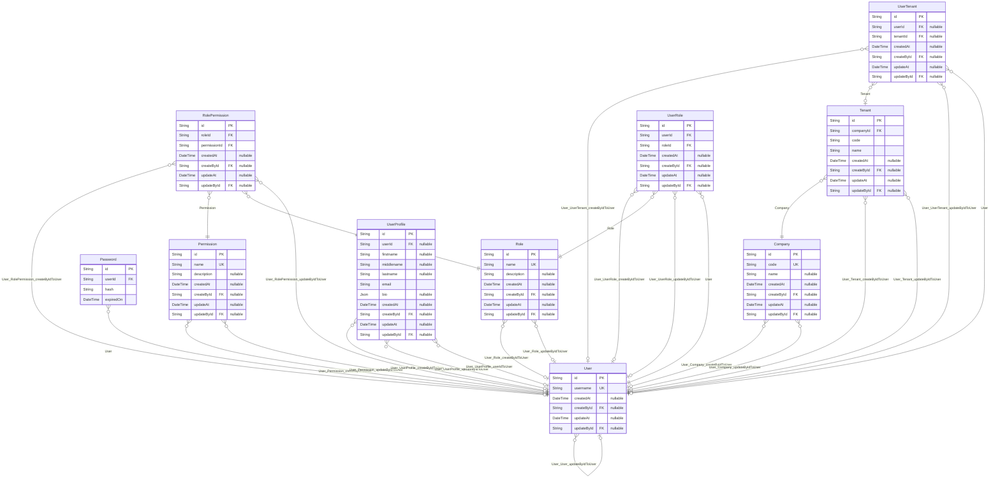

# Carmen Inventory System Database
> Generated by [`prisma-markdown`](https://github.com/samchon/prisma-markdown)

- [default](#default)

## default

### `Company`

**Properties**
  - `id`: 
  - `code`: 
  - `name`: 
  - `createdAt`: 
  - `createById`: 
  - `updateAt`: 
  - `updateById`: 

### `Password`

**Properties**
  - `id`: 
  - `userId`: 
  - `hash`: 
  - `expiredOn`: 

### `Permission`

**Properties**
  - `id`: 
  - `name`: 
  - `description`: 
  - `createdAt`: 
  - `createById`: 
  - `updateAt`: 
  - `updateById`: 

### `Role`

**Properties**
  - `id`: 
  - `name`: 
  - `description`: 
  - `createdAt`: 
  - `createById`: 
  - `updateAt`: 
  - `updateById`: 

### `RolePermission`

**Properties**
  - `id`: 
  - `roleId`: 
  - `permissionId`: 
  - `createdAt`: 
  - `createById`: 
  - `updateAt`: 
  - `updateById`: 

### `Tenant`

**Properties**
  - `id`: 
  - `companyId`: 
  - `code`: 
  - `name`: 
  - `createdAt`: 
  - `createById`: 
  - `updateAt`: 
  - `updateById`: 

### `User`

**Properties**
  - `id`: 
  - `username`: 
  - `createdAt`: 
  - `createById`: 
  - `updateAt`: 
  - `updateById`: 

### `UserProfile`

**Properties**
  - `id`: 
  - `userId`: 
  - `firstname`: 
  - `middlename`: 
  - `lastname`: 
  - `email`: 
  - `bio`: 
  - `createdAt`: 
  - `createById`: 
  - `updateAt`: 
  - `updateById`: 

### `UserRole`

**Properties**
  - `id`: 
  - `userId`: 
  - `roleId`: 
  - `createdAt`: 
  - `createById`: 
  - `updateAt`: 
  - `updateById`: 

### `UserTenant`

**Properties**
  - `id`: 
  - `userId`: 
  - `tenantId`: 
  - `createdAt`: 
  - `createById`: 
  - `updateAt`: 
  - `updateById`: 