# Carmen Inventory System Database
> Generated by [`prisma-markdown`](https://github.com/samchon/prisma-markdown)

- [default](#default)

## default

```mermaid
erDiagram
"business_unit_module_table" {
  String id PK
  String business_unit_id FK
  String module_id FK
  DateTime created_at "nullable"
  String created_by_id FK "nullable"
  DateTime updated_at "nullable"
  String updated_by_id FK "nullable"
}
"business_unit_table" {
  String id PK
  String cluster_id FK
  String code
  String name
  String description "nullable"
  Boolean is_hq "nullable"
  Boolean is_active "nullable"
  DateTime created_at "nullable"
  String created_by_id FK "nullable"
  DateTime updated_at "nullable"
  String updated_by_id FK "nullable"
}
"cluster_table" {
  String id PK
  String code UK
  String name UK
  Boolean is_active "nullable"
  Json info "nullable"
  DateTime created_at "nullable"
  String created_by_id FK "nullable"
  DateTime updated_at "nullable"
  String updated_by_id FK "nullable"
}
"module_table" {
  String id PK
  String name UK
  String description "nullable"
  DateTime created_at "nullable"
  String created_by_id FK "nullable"
  DateTime updated_at "nullable"
  String updated_by_id FK "nullable"
}
"notification_preference_table" {
  String id PK
  String user_id FK
  Boolean is_email
  Boolean is_sms "nullable"
  Boolean is_in_app "nullable"
  DateTime created_at "nullable"
  String created_by_id FK "nullable"
  DateTime updated_at "nullable"
  String updated_by_id FK "nullable"
}
"notification_table" {
  String id PK
  String user_id FK
  String message "nullable"
  Boolean is_read "nullable"
  Boolean is_sent "nullable"
  DateTime created_at "nullable"
  String created_by_id FK "nullable"
  DateTime updated_at "nullable"
  String updated_by_id FK "nullable"
}
"password_table" {
  String id PK
  String user_id FK
  String hash
  Boolean is_active "nullable"
  DateTime expiredOn
  DateTime created_at "nullable"
  String created_by_id FK "nullable"
}
"permission_table" {
  String id PK
  String group
  String name
  enum_permission_action action
  String description "nullable"
  DateTime created_at "nullable"
  String created_by_id FK "nullable"
  DateTime updated_at "nullable"
  String updated_by_id FK "nullable"
}
"role_permission_table" {
  String id PK
  String role_id FK
  String permission_id FK
  DateTime created_at "nullable"
  String created_by_id FK "nullable"
  DateTime updated_at "nullable"
  String updated_by_id FK "nullable"
}
"role_table" {
  String id PK
  String business_unit_id FK
  String name UK
  String description "nullable"
  DateTime created_at "nullable"
  String created_by_id FK "nullable"
  DateTime updated_at "nullable"
  String updated_by_id FK "nullable"
}
"subscription_detail_table" {
  String id PK
  String subscription_id FK
  String business_unit_id FK
  String module_id FK
  DateTime created_at "nullable"
  String created_by_id FK "nullable"
  DateTime updated_at "nullable"
  String updated_by_id FK "nullable"
}
"subscription_table" {
  String id PK
  String cluster_id FK
  String subscription_number
  DateTime start_date
  DateTime end_date
  enum_subscription_status status
  DateTime created_at "nullable"
  String created_by_id FK "nullable"
  DateTime updated_at "nullable"
  String updated_by_id FK "nullable"
}
"user_business_unit_table" {
  String id PK
  String user_id FK "nullable"
  String business_unit_id FK "nullable"
  Boolean is_active "nullable"
  DateTime created_at "nullable"
  String created_by_id FK "nullable"
  DateTime updated_at "nullable"
  String updated_by_id FK "nullable"
}
"user_profile_table" {
  String id PK
  String user_id FK "nullable"
  String firstname
  String middlename "nullable"
  String lastname "nullable"
  Json bio "nullable"
  DateTime created_at "nullable"
  String created_by_id FK "nullable"
  DateTime updated_at "nullable"
  String updated_by_id FK "nullable"
}
"user_role_table" {
  String id PK
  String user_id FK
  String role_id FK
  DateTime created_at "nullable"
  String created_by_id FK "nullable"
  DateTime updated_at "nullable"
  String updated_by_id FK "nullable"
}
"user_table" {
  String id PK
  String username UK
  String email
  Boolean is_active "nullable"
  Boolean is_consent "nullable"
  DateTime consent "nullable"
  DateTime created_at "nullable"
  String created_by_id FK "nullable"
  DateTime updated_at "nullable"
  String updated_by_id FK "nullable"
}
"business_unit_module_table" }o--|| "business_unit_table" : business_unit_table
"business_unit_module_table" }o--o| "user_table" : user_table_business_unit_module_table_created_by_idTouser_table
"business_unit_module_table" }o--|| "module_table" : module_table
"business_unit_module_table" }o--o| "user_table" : user_table_business_unit_module_table_updated_by_idTouser_table
"business_unit_table" }o--|| "cluster_table" : cluster_table
"business_unit_table" }o--o| "user_table" : user_table_business_unit_table_created_by_idTouser_table
"business_unit_table" }o--o| "user_table" : user_table_business_unit_table_updated_by_idTouser_table
"cluster_table" }o--o| "user_table" : user_table_cluster_table_created_by_idTouser_table
"cluster_table" }o--o| "user_table" : user_table_cluster_table_updated_by_idTouser_table
"module_table" }o--o| "user_table" : user_table_module_table_created_by_idTouser_table
"module_table" }o--o| "user_table" : user_table_module_table_updated_by_idTouser_table
"notification_preference_table" }o--o| "user_table" : user_table_notification_preference_table_created_by_idTouser_table
"notification_preference_table" }o--o| "user_table" : user_table_notification_preference_table_updated_by_idTouser_table
"notification_preference_table" |o--|| "user_table" : user_table_notification_preference_table_user_idTouser_table
"notification_table" }o--o| "user_table" : user_table_notification_table_created_by_idTouser_table
"notification_table" }o--o| "user_table" : user_table_notification_table_updated_by_idTouser_table
"notification_table" }o--|| "user_table" : user_table_notification_table_user_idTouser_table
"password_table" }o--o| "user_table" : user_table_password_table_created_by_idTouser_table
"password_table" }o--|| "user_table" : user_table
"permission_table" }o--o| "user_table" : user_table_permission_table_created_by_idTouser_table
"permission_table" }o--o| "user_table" : user_table_permission_table_updated_by_idTouser_table
"role_permission_table" }o--o| "user_table" : user_table_role_permission_table_created_by_idTouser_table
"role_permission_table" }o--|| "permission_table" : permission_table
"role_permission_table" }o--|| "role_table" : role_table
"role_permission_table" }o--o| "user_table" : user_table_role_permission_table_updated_by_idTouser_table
"role_table" }o--|| "business_unit_table" : business_unit_table
"role_table" }o--o| "user_table" : user_table_role_table_created_by_idTouser_table
"role_table" }o--o| "user_table" : user_table_role_table_updated_by_idTouser_table
"subscription_detail_table" }o--|| "business_unit_table" : business_unit_table
"subscription_detail_table" }o--o| "user_table" : user_table_subscription_detail_table_created_by_idTouser_table
"subscription_detail_table" }o--|| "module_table" : module_table
"subscription_detail_table" }o--|| "subscription_table" : subscription_table
"subscription_detail_table" }o--o| "user_table" : user_table_subscription_detail_table_updated_by_idTouser_table
"subscription_table" }o--|| "cluster_table" : cluster_table
"subscription_table" }o--o| "user_table" : user_table_subscription_table_created_by_idTouser_table
"subscription_table" }o--o| "user_table" : user_table_subscription_table_updated_by_idTouser_table
"user_business_unit_table" }o--o| "business_unit_table" : business_unit_table
"user_business_unit_table" }o--o| "user_table" : user_table_user_business_unit_table_created_by_idTouser_table
"user_business_unit_table" }o--o| "user_table" : user_table_user_business_unit_table_updated_by_idTouser_table
"user_business_unit_table" }o--o| "user_table" : user_table
"user_profile_table" }o--o| "user_table" : user_table_user_profile_table_created_by_idTouser_table
"user_profile_table" }o--o| "user_table" : user_table_user_profile_table_updated_by_idTouser_table
"user_profile_table" }o--o| "user_table" : user_table_user_profile_table_user_idTouser_table
"user_role_table" }o--o| "user_table" : user_table_user_role_table_created_by_idTouser_table
"user_role_table" }o--|| "role_table" : role_table
"user_role_table" }o--o| "user_table" : user_table_user_role_table_updated_by_idTouser_table
"user_role_table" }o--|| "user_table" : user_table_user_role_table_user_idTouser_table
"user_table" }o--o| "user_table" : user_table_user_table_created_by_idTouser_table
"user_table" }o--o| "user_table" : user_table_user_table_updated_by_idTouser_table
```

### `business_unit_module_table`

**Properties**
  - `id`: 
  - `business_unit_id`: 
  - `module_id`: 
  - `created_at`: 
  - `created_by_id`: 
  - `updated_at`: 
  - `updated_by_id`: 

### `business_unit_table`

**Properties**
  - `id`: 
  - `cluster_id`: 
  - `code`: 
  - `name`: 
  - `description`: 
  - `is_hq`: 
  - `is_active`: 
  - `created_at`: 
  - `created_by_id`: 
  - `updated_at`: 
  - `updated_by_id`: 

### `cluster_table`

**Properties**
  - `id`: 
  - `code`: 
  - `name`: 
  - `is_active`: 
  - `info`: 
  - `created_at`: 
  - `created_by_id`: 
  - `updated_at`: 
  - `updated_by_id`: 

### `module_table`

**Properties**
  - `id`: 
  - `name`: 
  - `description`: 
  - `created_at`: 
  - `created_by_id`: 
  - `updated_at`: 
  - `updated_by_id`: 

### `notification_preference_table`

**Properties**
  - `id`: 
  - `user_id`: 
  - `is_email`: 
  - `is_sms`: 
  - `is_in_app`: 
  - `created_at`: 
  - `created_by_id`: 
  - `updated_at`: 
  - `updated_by_id`: 

### `notification_table`

**Properties**
  - `id`: 
  - `user_id`: 
  - `message`: 
  - `is_read`: 
  - `is_sent`: 
  - `created_at`: 
  - `created_by_id`: 
  - `updated_at`: 
  - `updated_by_id`: 

### `password_table`

**Properties**
  - `id`: 
  - `user_id`: 
  - `hash`: 
  - `is_active`: 
  - `expiredOn`: 
  - `created_at`: 
  - `created_by_id`: 

### `permission_table`

**Properties**
  - `id`: 
  - `group`: 
  - `name`: 
  - `action`: 
  - `description`: 
  - `created_at`: 
  - `created_by_id`: 
  - `updated_at`: 
  - `updated_by_id`: 

### `role_permission_table`

**Properties**
  - `id`: 
  - `role_id`: 
  - `permission_id`: 
  - `created_at`: 
  - `created_by_id`: 
  - `updated_at`: 
  - `updated_by_id`: 

### `role_table`

**Properties**
  - `id`: 
  - `business_unit_id`: 
  - `name`: 
  - `description`: 
  - `created_at`: 
  - `created_by_id`: 
  - `updated_at`: 
  - `updated_by_id`: 

### `subscription_detail_table`

**Properties**
  - `id`: 
  - `subscription_id`: 
  - `business_unit_id`: 
  - `module_id`: 
  - `created_at`: 
  - `created_by_id`: 
  - `updated_at`: 
  - `updated_by_id`: 

### `subscription_table`

**Properties**
  - `id`: 
  - `cluster_id`: 
  - `subscription_number`: 
  - `start_date`: 
  - `end_date`: 
  - `status`: 
  - `created_at`: 
  - `created_by_id`: 
  - `updated_at`: 
  - `updated_by_id`: 

### `user_business_unit_table`

**Properties**
  - `id`: 
  - `user_id`: 
  - `business_unit_id`: 
  - `is_active`: 
  - `created_at`: 
  - `created_by_id`: 
  - `updated_at`: 
  - `updated_by_id`: 

### `user_profile_table`

**Properties**
  - `id`: 
  - `user_id`: 
  - `firstname`: 
  - `middlename`: 
  - `lastname`: 
  - `bio`: 
  - `created_at`: 
  - `created_by_id`: 
  - `updated_at`: 
  - `updated_by_id`: 

### `user_role_table`

**Properties**
  - `id`: 
  - `user_id`: 
  - `role_id`: 
  - `created_at`: 
  - `created_by_id`: 
  - `updated_at`: 
  - `updated_by_id`: 

### `user_table`

**Properties**
  - `id`: 
  - `username`: 
  - `email`: 
  - `is_active`: 
  - `is_consent`: 
  - `consent`: 
  - `created_at`: 
  - `created_by_id`: 
  - `updated_at`: 
  - `updated_by_id`: 