# Carmen Inventory Tenant Database
> Generated by [`prisma-markdown`](https://github.com/samchon/prisma-markdown)

- [default](#default)

## default

```mermaid
erDiagram
"tb_activity" {
  String id PK
  enum_activity_action action "nullable"
  enum_activity_entity_type entity_type "nullable"
  String entity_id "nullable"
  String actor_id "nullable"
  Json meta_data "nullable"
  Json old_data "nullable"
  Json new_data "nullable"
  String ip_address "nullable"
  String user_agent "nullable"
  String description "nullable"
  DateTime created_at "nullable"
  String created_by_id "nullable"
}
"tb_credit_note" {
  String id PK
  String inventory_transaction_id FK
  String name "nullable"
  DateTime created_at "nullable"
  String created_by_id "nullable"
  DateTime updated_at "nullable"
  String updated_by_id "nullable"
}
"tb_credit_note_detail" {
  String id PK
  String credit_note_id FK
  String name "nullable"
  Decimal qty "nullable"
  Decimal amount "nullable"
  DateTime created_at "nullable"
  String created_by_id "nullable"
  DateTime updated_at "nullable"
  String updated_by_id "nullable"
}
"tb_currency" {
  String id PK
  String code UK
  String name
  String symbol "nullable"
  String description "nullable"
  Boolean is_active "nullable"
  Float rate "nullable"
  DateTime created_at "nullable"
  String created_by_id "nullable"
  DateTime updated_at "nullable"
  String updated_by_id "nullable"
}
"tb_delivery_point" {
  String id PK
  String name UK
  Boolean is_active "nullable"
  DateTime created_at "nullable"
  String created_by_id "nullable"
  DateTime updated_at "nullable"
  String updated_by_id "nullable"
}
"tb_department" {
  String id PK
  String name UK
  String description "nullable"
  Boolean is_active "nullable"
  DateTime created_at "nullable"
  String created_by_id "nullable"
  DateTime updated_at "nullable"
  String updated_by_id "nullable"
}
"tb_exchange_rate" {
  String id PK
  DateTime at_date "nullable"
  String currency_id FK "nullable"
  Float rate "nullable"
  DateTime created_at "nullable"
  String created_by_id "nullable"
  DateTime updated_at "nullable"
  String updated_by_id "nullable"
}
"tb_good_receive_note" {
  String id PK
  String inventory_transaction_id FK
  String name "nullable"
  DateTime created_at "nullable"
  String created_by_id "nullable"
  DateTime updated_at "nullable"
  String updated_by_id "nullable"
}
"tb_good_receive_note_detail" {
  String id PK
  String good_receive_note_id FK
  String name "nullable"
  Decimal qty "nullable"
  DateTime created_at "nullable"
  String created_by_id "nullable"
  DateTime updated_at "nullable"
  String updated_by_id "nullable"
}
"tb_inventory_transaction" {
  String id PK
  String name UK
  enum_inventory_doc_type inventory_doc_type
  DateTime created_at "nullable"
  String created_by_id "nullable"
  DateTime updated_at "nullable"
  String updated_by_id "nullable"
}
"tb_inventory_transaction_closing_balance" {
  String id PK
  String inventory_transaction_detail_id FK
  String lot_name "nullable"
  Int lot_index
  Decimal qty "nullable"
  Decimal cost "nullable"
  DateTime created_at "nullable"
  String created_by_id "nullable"
  DateTime updated_at "nullable"
  String updated_by_id "nullable"
}
"tb_inventory_transaction_detail" {
  String id PK
  String inventory_transaction_id FK
  String from_lot_name "nullable"
  String current_lot_name "nullable"
  Decimal qty "nullable"
  Decimal cost "nullable"
  DateTime created_at "nullable"
  String created_by_id "nullable"
  DateTime updated_at "nullable"
  String updated_by_id "nullable"
}
"tb_location" {
  String id PK
  String name UK
  enum_location_type location_type
  String description "nullable"
  Boolean is_active "nullable"
  String delivery_point_id FK "nullable"
  DateTime created_at "nullable"
  String created_by_id "nullable"
  DateTime updated_at "nullable"
  String updated_by_id "nullable"
}
"tb_menu" {
  String id PK
  String module_id
  String name
  String url
  String description "nullable"
  Boolean is_visible "nullable"
  Boolean is_active "nullable"
  Boolean is_lock "nullable"
  DateTime created_at "nullable"
  String created_by_id "nullable"
  DateTime updated_at "nullable"
  String updated_by_id "nullable"
}
"tb_product" {
  String id PK
  String code UK
  String name UK
  String description "nullable"
  String primary_unit FK
  Boolean is_active "nullable"
  DateTime created_at "nullable"
  String created_by_id "nullable"
  DateTime updated_at "nullable"
  String updated_by_id "nullable"
}
"tb_product_category" {
  String id PK
  String code UK
  String name UK
  String description "nullable"
  Boolean is_active "nullable"
  DateTime created_at "nullable"
  String created_by_id "nullable"
  DateTime updated_at "nullable"
  String updated_by_id "nullable"
}
"tb_product_info" {
  String id PK
  String product_id FK
  Float price "nullable"
  Json info "nullable"
  DateTime created_at "nullable"
  String created_by_id "nullable"
  DateTime updated_at "nullable"
  String updated_by_id "nullable"
}
"tb_product_item_group" {
  String id PK
  String code
  String name
  String description "nullable"
  Boolean is_active "nullable"
  String product_subcategory_id FK
  DateTime created_at "nullable"
  String created_by_id "nullable"
  DateTime updated_at "nullable"
  String updated_by_id "nullable"
}
"tb_product_sub_category" {
  String id PK
  String code
  String name
  String description "nullable"
  Boolean is_active "nullable"
  String product_category_id FK
  DateTime created_at "nullable"
  String created_by_id "nullable"
  DateTime updated_at "nullable"
  String updated_by_id "nullable"
}
"tb_product_tb_vendor" {
  String id PK
  String product_id FK "nullable"
  String vendor_id FK "nullable"
  String vendor_product_name "nullable"
  String description "nullable"
  Boolean is_active "nullable"
  DateTime created_at "nullable"
  String created_by_id "nullable"
  DateTime updated_at "nullable"
  String updated_by_id "nullable"
}
"tb_purchase_order" {
  String id PK
  String name UK
  enum_purchase_order_doc_status purchase_order_status "nullable"
  String description "nullable"
  DateTime order_date "nullable"
  Json history "nullable"
  Boolean is_active "nullable"
  DateTime created_at "nullable"
  String created_by_id "nullable"
  DateTime updated_at "nullable"
  String updated_by_id "nullable"
}
"tb_purchase_order_detail" {
  String id PK
  String name UK "nullable"
  String description "nullable"
  Boolean is_active "nullable"
  String purchase_order_id FK "nullable"
  String purchase_request_detail_id FK "nullable"
  Json history "nullable"
  DateTime created_at "nullable"
  String created_by_id "nullable"
  DateTime updated_at "nullable"
  String updated_by_id "nullable"
}
"tb_purchase_request" {
  String id PK
  String reference_name UK
  DateTime purchase_request_date "nullable"
  String workflow_id FK "nullable"
  Json workflow_obj "nullable"
  Json workflow_history "nullable"
  enum_purchase_request_doc_status purchase_request_status "nullable"
  String requestor_id "nullable"
  String department_id "nullable"
  Boolean is_active "nullable"
  DateTime created_at "nullable"
  String created_by_id "nullable"
  DateTime updated_at "nullable"
  String updated_by_id "nullable"
}
"tb_purchase_request_detail" {
  String id PK
  String purchase_request_id FK "nullable"
  String location_id "nullable"
  String product_id "nullable"
  String unit_id "nullable"
  String description "nullable"
  Float requested_qty "nullable"
  Float approved_qty "nullable"
  String currency_id "nullable"
  Float currency_rate "nullable"
  Decimal price "nullable"
  Decimal total_price "nullable"
  Json workflow_history "nullable"
  DateTime created_at "nullable"
  String created_by_id "nullable"
  DateTime updated_at "nullable"
  String updated_by_id "nullable"
}
"tb_stock_in" {
  String id PK
  String inventory_transaction_id FK
  String name "nullable"
  DateTime created_at "nullable"
  String created_by_id "nullable"
  DateTime updated_at "nullable"
  String updated_by_id "nullable"
}
"tb_stock_in_detail" {
  String id PK
  String stock_in_id FK
  String name "nullable"
  Decimal qty "nullable"
  DateTime created_at "nullable"
  String created_by_id "nullable"
  DateTime updated_at "nullable"
  String updated_by_id "nullable"
}
"tb_stock_out" {
  String id PK
  String inventory_transaction_id FK
  String name "nullable"
  DateTime created_at "nullable"
  String created_by_id "nullable"
  DateTime updated_at "nullable"
  String updated_by_id "nullable"
}
"tb_stock_out_detail" {
  String id PK
  String stock_in_id FK
  String name "nullable"
  Decimal qty "nullable"
  DateTime created_at "nullable"
  String created_by_id "nullable"
  DateTime updated_at "nullable"
  String updated_by_id "nullable"
}
"tb_stock_take" {
  String id PK
  String inventory_transaction_id FK
  String name "nullable"
  DateTime created_at "nullable"
  String created_by_id "nullable"
  DateTime updated_at "nullable"
  String updated_by_id "nullable"
}
"tb_stock_take_detail" {
  String id PK
  String stock_take_id FK
  String name "nullable"
  Decimal qty "nullable"
  DateTime created_at "nullable"
  String created_by_id "nullable"
  DateTime updated_at "nullable"
  String updated_by_id "nullable"
}
"tb_store_requisition" {
  String id PK
  String inventory_transaction_id FK
  String name "nullable"
  DateTime created_at "nullable"
  String created_by_id "nullable"
  DateTime updated_at "nullable"
  String updated_by_id "nullable"
}
"tb_store_requisition_detail" {
  String id PK
  String store_requisition_id FK
  String name "nullable"
  Decimal qty "nullable"
  DateTime created_at "nullable"
  String created_by_id "nullable"
  DateTime updated_at "nullable"
  String updated_by_id "nullable"
}
"tb_unit" {
  String id PK
  String name UK
  String description "nullable"
  Boolean is_active "nullable"
  DateTime created_at "nullable"
  String created_by_id "nullable"
  DateTime updated_at "nullable"
  String updated_by_id "nullable"
}
"tb_unit_conversion" {
  String id PK
  String product_id FK "nullable"
  enum_unit_type unit_type
  String from_unit_id FK "nullable"
  Float from_unit_qty "nullable"
  String to_unit_id FK "nullable"
  Float to_unit_qty "nullable"
  String description "nullable"
  Boolean is_active "nullable"
  DateTime created_at "nullable"
  String created_by_id "nullable"
  DateTime updated_at "nullable"
  String updated_by_id "nullable"
}
"tb_vendor" {
  String id PK
  String name UK
  String description "nullable"
  Boolean is_active "nullable"
  DateTime created_at "nullable"
  String created_by_id "nullable"
  DateTime updated_at "nullable"
  String updated_by_id "nullable"
}
"tb_vendor_address" {
  String id PK
  String vendor_id FK "nullable"
  enum_vendor_address_type address_type "nullable"
  Json address "nullable"
  Boolean is_active "nullable"
  DateTime created_at "nullable"
  String created_by_id "nullable"
  DateTime updated_at "nullable"
  String updated_by_id "nullable"
}
"tb_vendor_contact" {
  String id PK
  String vendor_id FK "nullable"
  enum_vendor_contact_type contact_type
  String description "nullable"
  Boolean is_active "nullable"
  Json info "nullable"
  DateTime created_at "nullable"
  String created_by_id "nullable"
  DateTime updated_at "nullable"
  String updated_by_id "nullable"
}
"tb_workflow" {
  String id PK
  String name UK
  enum_workflow_type workflow_type
  String description "nullable"
  Boolean is_active "nullable"
  DateTime created_at "nullable"
  String created_by_id "nullable"
  DateTime updated_at "nullable"
  String updated_by_id "nullable"
}
"tb_credit_note" }o--|| "tb_inventory_transaction" : tb_inventory_transaction
"tb_credit_note_detail" }o--|| "tb_credit_note" : tb_credit_note
"tb_exchange_rate" }o--o| "tb_currency" : tb_currency
"tb_good_receive_note" }o--|| "tb_inventory_transaction" : tb_inventory_transaction
"tb_good_receive_note_detail" }o--|| "tb_good_receive_note" : tb_good_receive_note
"tb_inventory_transaction_closing_balance" }o--|| "tb_inventory_transaction_detail" : tb_inventory_transaction_detail
"tb_inventory_transaction_detail" }o--|| "tb_inventory_transaction" : tb_inventory_transaction
"tb_location" }o--o| "tb_delivery_point" : tb_delivery_point
"tb_product" }o--|| "tb_unit" : tb_unit
"tb_product_info" |o--|| "tb_product" : tb_product
"tb_product_item_group" }o--|| "tb_product_sub_category" : tb_product_sub_category
"tb_product_sub_category" }o--|| "tb_product_category" : tb_product_category
"tb_product_tb_vendor" }o--o| "tb_product" : tb_product
"tb_product_tb_vendor" }o--o| "tb_vendor" : tb_vendor
"tb_purchase_order_detail" }o--o| "tb_purchase_order" : tb_purchase_order
"tb_purchase_order_detail" }o--o| "tb_purchase_request_detail" : tb_purchase_request_detail
"tb_purchase_request" }o--o| "tb_workflow" : tb_workflow
"tb_purchase_request_detail" }o--o| "tb_purchase_request" : tb_purchase_request
"tb_stock_in" }o--|| "tb_inventory_transaction" : tb_inventory_transaction
"tb_stock_in_detail" }o--|| "tb_stock_in" : tb_stock_in
"tb_stock_out" }o--|| "tb_inventory_transaction" : tb_inventory_transaction
"tb_stock_out_detail" }o--|| "tb_stock_out" : tb_stock_out
"tb_stock_take" }o--|| "tb_inventory_transaction" : tb_inventory_transaction
"tb_stock_take_detail" }o--|| "tb_stock_take" : tb_stock_take
"tb_store_requisition" }o--|| "tb_inventory_transaction" : tb_inventory_transaction
"tb_store_requisition_detail" }o--|| "tb_store_requisition" : tb_store_requisition
"tb_unit_conversion" }o--o| "tb_unit" : tb_unit_tb_unit_conversion_from_unit_idTotb_unit
"tb_unit_conversion" }o--o| "tb_product" : tb_product
"tb_unit_conversion" }o--o| "tb_unit" : tb_unit_tb_unit_conversion_to_unit_idTotb_unit
"tb_vendor_address" }o--o| "tb_vendor" : tb_vendor
"tb_vendor_contact" }o--o| "tb_vendor" : tb_vendor
```

### `tb_activity`

**Properties**
  - `id`: 
  - `action`: 
  - `entity_type`: 
  - `entity_id`: 
  - `actor_id`: 
  - `meta_data`: 
  - `old_data`: 
  - `new_data`: 
  - `ip_address`: 
  - `user_agent`: 
  - `description`: 
  - `created_at`: 
  - `created_by_id`: 

### `tb_credit_note`

**Properties**
  - `id`: 
  - `inventory_transaction_id`: 
  - `name`: 
  - `created_at`: 
  - `created_by_id`: 
  - `updated_at`: 
  - `updated_by_id`: 

### `tb_credit_note_detail`

**Properties**
  - `id`: 
  - `credit_note_id`: 
  - `name`: 
  - `qty`: 
  - `amount`: 
  - `created_at`: 
  - `created_by_id`: 
  - `updated_at`: 
  - `updated_by_id`: 

### `tb_currency`

**Properties**
  - `id`: 
  - `code`: 
  - `name`: 
  - `symbol`: 
  - `description`: 
  - `is_active`: 
  - `rate`: 
  - `created_at`: 
  - `created_by_id`: 
  - `updated_at`: 
  - `updated_by_id`: 

### `tb_delivery_point`

**Properties**
  - `id`: 
  - `name`: 
  - `is_active`: 
  - `created_at`: 
  - `created_by_id`: 
  - `updated_at`: 
  - `updated_by_id`: 

### `tb_department`

**Properties**
  - `id`: 
  - `name`: 
  - `description`: 
  - `is_active`: 
  - `created_at`: 
  - `created_by_id`: 
  - `updated_at`: 
  - `updated_by_id`: 

### `tb_exchange_rate`

**Properties**
  - `id`: 
  - `at_date`: 
  - `currency_id`: 
  - `rate`: 
  - `created_at`: 
  - `created_by_id`: 
  - `updated_at`: 
  - `updated_by_id`: 

### `tb_good_receive_note`

**Properties**
  - `id`: 
  - `inventory_transaction_id`: 
  - `name`: 
  - `created_at`: 
  - `created_by_id`: 
  - `updated_at`: 
  - `updated_by_id`: 

### `tb_good_receive_note_detail`

**Properties**
  - `id`: 
  - `good_receive_note_id`: 
  - `name`: 
  - `qty`: 
  - `created_at`: 
  - `created_by_id`: 
  - `updated_at`: 
  - `updated_by_id`: 

### `tb_inventory_transaction`

**Properties**
  - `id`: 
  - `name`: 
  - `inventory_doc_type`: 
  - `created_at`: 
  - `created_by_id`: 
  - `updated_at`: 
  - `updated_by_id`: 

### `tb_inventory_transaction_closing_balance`

**Properties**
  - `id`: 
  - `inventory_transaction_detail_id`: 
  - `lot_name`: 
  - `lot_index`: 
  - `qty`: 
  - `cost`: 
  - `created_at`: 
  - `created_by_id`: 
  - `updated_at`: 
  - `updated_by_id`: 

### `tb_inventory_transaction_detail`

**Properties**
  - `id`: 
  - `inventory_transaction_id`: 
  - `from_lot_name`: 
  - `current_lot_name`: 
  - `qty`: 
  - `cost`: 
  - `created_at`: 
  - `created_by_id`: 
  - `updated_at`: 
  - `updated_by_id`: 

### `tb_location`

**Properties**
  - `id`: 
  - `name`: 
  - `location_type`: 
  - `description`: 
  - `is_active`: 
  - `delivery_point_id`: 
  - `created_at`: 
  - `created_by_id`: 
  - `updated_at`: 
  - `updated_by_id`: 

### `tb_menu`

**Properties**
  - `id`: 
  - `module_id`: 
  - `name`: 
  - `url`: 
  - `description`: 
  - `is_visible`: 
  - `is_active`: 
  - `is_lock`: 
  - `created_at`: 
  - `created_by_id`: 
  - `updated_at`: 
  - `updated_by_id`: 

### `tb_product`

**Properties**
  - `id`: 
  - `code`: 
  - `name`: 
  - `description`: 
  - `primary_unit`: 
  - `is_active`: 
  - `created_at`: 
  - `created_by_id`: 
  - `updated_at`: 
  - `updated_by_id`: 

### `tb_product_category`

**Properties**
  - `id`: 
  - `code`: 
  - `name`: 
  - `description`: 
  - `is_active`: 
  - `created_at`: 
  - `created_by_id`: 
  - `updated_at`: 
  - `updated_by_id`: 

### `tb_product_info`

**Properties**
  - `id`: 
  - `product_id`: 
  - `price`: 
  - `info`: 
  - `created_at`: 
  - `created_by_id`: 
  - `updated_at`: 
  - `updated_by_id`: 

### `tb_product_item_group`

**Properties**
  - `id`: 
  - `code`: 
  - `name`: 
  - `description`: 
  - `is_active`: 
  - `product_subcategory_id`: 
  - `created_at`: 
  - `created_by_id`: 
  - `updated_at`: 
  - `updated_by_id`: 

### `tb_product_sub_category`

**Properties**
  - `id`: 
  - `code`: 
  - `name`: 
  - `description`: 
  - `is_active`: 
  - `product_category_id`: 
  - `created_at`: 
  - `created_by_id`: 
  - `updated_at`: 
  - `updated_by_id`: 

### `tb_product_tb_vendor`

**Properties**
  - `id`: 
  - `product_id`: 
  - `vendor_id`: 
  - `vendor_product_name`: 
  - `description`: 
  - `is_active`: 
  - `created_at`: 
  - `created_by_id`: 
  - `updated_at`: 
  - `updated_by_id`: 

### `tb_purchase_order`

**Properties**
  - `id`: 
  - `name`: 
  - `purchase_order_status`: 
  - `description`: 
  - `order_date`: 
  - `history`: 
  - `is_active`: 
  - `created_at`: 
  - `created_by_id`: 
  - `updated_at`: 
  - `updated_by_id`: 

### `tb_purchase_order_detail`

**Properties**
  - `id`: 
  - `name`: 
  - `description`: 
  - `is_active`: 
  - `purchase_order_id`: 
  - `purchase_request_detail_id`: 
  - `history`: 
  - `created_at`: 
  - `created_by_id`: 
  - `updated_at`: 
  - `updated_by_id`: 

### `tb_purchase_request`

**Properties**
  - `id`: 
  - `reference_name`: 
  - `purchase_request_date`: 
  - `workflow_id`: 
  - `workflow_obj`: 
  - `workflow_history`: 
  - `purchase_request_status`: 
  - `requestor_id`: 
  - `department_id`: 
  - `is_active`: 
  - `created_at`: 
  - `created_by_id`: 
  - `updated_at`: 
  - `updated_by_id`: 

### `tb_purchase_request_detail`

**Properties**
  - `id`: 
  - `purchase_request_id`: 
  - `location_id`: 
  - `product_id`: 
  - `unit_id`: 
  - `description`: 
  - `requested_qty`: 
  - `approved_qty`: 
  - `currency_id`: 
  - `currency_rate`: 
  - `price`: 
  - `total_price`: 
  - `workflow_history`: 
  - `created_at`: 
  - `created_by_id`: 
  - `updated_at`: 
  - `updated_by_id`: 

### `tb_stock_in`

**Properties**
  - `id`: 
  - `inventory_transaction_id`: 
  - `name`: 
  - `created_at`: 
  - `created_by_id`: 
  - `updated_at`: 
  - `updated_by_id`: 

### `tb_stock_in_detail`

**Properties**
  - `id`: 
  - `stock_in_id`: 
  - `name`: 
  - `qty`: 
  - `created_at`: 
  - `created_by_id`: 
  - `updated_at`: 
  - `updated_by_id`: 

### `tb_stock_out`

**Properties**
  - `id`: 
  - `inventory_transaction_id`: 
  - `name`: 
  - `created_at`: 
  - `created_by_id`: 
  - `updated_at`: 
  - `updated_by_id`: 

### `tb_stock_out_detail`

**Properties**
  - `id`: 
  - `stock_in_id`: 
  - `name`: 
  - `qty`: 
  - `created_at`: 
  - `created_by_id`: 
  - `updated_at`: 
  - `updated_by_id`: 

### `tb_stock_take`

**Properties**
  - `id`: 
  - `inventory_transaction_id`: 
  - `name`: 
  - `created_at`: 
  - `created_by_id`: 
  - `updated_at`: 
  - `updated_by_id`: 

### `tb_stock_take_detail`

**Properties**
  - `id`: 
  - `stock_take_id`: 
  - `name`: 
  - `qty`: 
  - `created_at`: 
  - `created_by_id`: 
  - `updated_at`: 
  - `updated_by_id`: 

### `tb_store_requisition`

**Properties**
  - `id`: 
  - `inventory_transaction_id`: 
  - `name`: 
  - `created_at`: 
  - `created_by_id`: 
  - `updated_at`: 
  - `updated_by_id`: 

### `tb_store_requisition_detail`

**Properties**
  - `id`: 
  - `store_requisition_id`: 
  - `name`: 
  - `qty`: 
  - `created_at`: 
  - `created_by_id`: 
  - `updated_at`: 
  - `updated_by_id`: 

### `tb_unit`

**Properties**
  - `id`: 
  - `name`: 
  - `description`: 
  - `is_active`: 
  - `created_at`: 
  - `created_by_id`: 
  - `updated_at`: 
  - `updated_by_id`: 

### `tb_unit_conversion`

**Properties**
  - `id`: 
  - `product_id`: 
  - `unit_type`: 
  - `from_unit_id`: 
  - `from_unit_qty`: 
  - `to_unit_id`: 
  - `to_unit_qty`: 
  - `description`: 
  - `is_active`: 
  - `created_at`: 
  - `created_by_id`: 
  - `updated_at`: 
  - `updated_by_id`: 

### `tb_vendor`

**Properties**
  - `id`: 
  - `name`: 
  - `description`: 
  - `is_active`: 
  - `created_at`: 
  - `created_by_id`: 
  - `updated_at`: 
  - `updated_by_id`: 

### `tb_vendor_address`

**Properties**
  - `id`: 
  - `vendor_id`: 
  - `address_type`: 
  - `address`: 
  - `is_active`: 
  - `created_at`: 
  - `created_by_id`: 
  - `updated_at`: 
  - `updated_by_id`: 

### `tb_vendor_contact`

**Properties**
  - `id`: 
  - `vendor_id`: 
  - `contact_type`: 
  - `description`: 
  - `is_active`: 
  - `info`: 
  - `created_at`: 
  - `created_by_id`: 
  - `updated_at`: 
  - `updated_by_id`: 

### `tb_workflow`

**Properties**
  - `id`: 
  - `name`: 
  - `workflow_type`: 
  - `description`: 
  - `is_active`: 
  - `created_at`: 
  - `created_by_id`: 
  - `updated_at`: 
  - `updated_by_id`: 