# Carmen Inventory Tenant Database
> Generated by [`prisma-markdown`](https://github.com/samchon/prisma-markdown)

- [default](#default)

## default

```mermaid
erDiagram
"address_type_table" {
  String id PK
  String name UK
  String description "nullable"
  Boolean isActive "nullable"
  DateTime createdAt "nullable"
  String createById "nullable"
  DateTime updateAt "nullable"
  String updateById "nullable"
}
"contact_type_table" {
  String id PK
  String name UK
  String description "nullable"
  Boolean isActive "nullable"
  DateTime createdAt "nullable"
  String createById "nullable"
  DateTime updateAt "nullable"
  String updateById "nullable"
}
"currency_table" {
  String id PK
  String code UK
  String name
  String symbol "nullable"
  String description "nullable"
  Boolean isActive "nullable"
  Float rate "nullable"
  DateTime createdAt "nullable"
  String createById "nullable"
  DateTime updateAt "nullable"
  String updateById "nullable"
}
"delivery_point_table" {
  String id PK
  String name UK
  Boolean isActive "nullable"
  DateTime createdAt "nullable"
  String createById "nullable"
  DateTime updateAt "nullable"
  String updateById "nullable"
}
"department_table" {
  String id PK
  String name UK
  String description "nullable"
  Boolean isActive "nullable"
  DateTime createdAt "nullable"
  String createById "nullable"
  DateTime updateAt "nullable"
  String updateById "nullable"
}
"exchange_rate_table" {
  String id PK
  DateTime dateAt "nullable"
  String currencyId FK "nullable"
  Float rate "nullable"
  DateTime createdAt "nullable"
  String createById "nullable"
  DateTime updateAt "nullable"
  String updateById "nullable"
}
"global_activity_table" {
  String id PK
  enum_activity_action action "nullable"
  String entityType "nullable"
  String entityId "nullable"
  String actorId "nullable"
  Json metadata "nullable"
  Json oldData "nullable"
  Json newData "nullable"
  String ipAddress "nullable"
  String userAgent "nullable"
  String description "nullable"
  DateTime createdAt "nullable"
  String createById "nullable"
}
"good_receive_note_0_table" {
  String id PK
  String inv0Id FK
  String name "nullable"
}
"good_receive_note_1_table" {
  String id PK
  String GRN0Id FK
  String name "nullable"
}
"inventory_transaction_0_table" {
  String id PK
  String name UK
  enum_inventory_doc_type invDocType "nullable"
}
"inventory_transaction_1_table" {
  String id PK
  String inv0Id FK
  String fromLot "nullable"
  String currentLotName "nullable"
  Decimal qty "nullable"
  Decimal cost "nullable"
}
"inventory_transaction_2_table" {
  String id PK
  String inv1Id FK
  String lotName "nullable"
  Int lotIndex
  Decimal qty "nullable"
  Decimal cost "nullable"
}
"location_table" {
  String id PK
  String name UK
  enum_location_type locationType
  String description "nullable"
  Boolean isActive "nullable"
  String deliveryPointId FK "nullable"
  DateTime createdAt "nullable"
  String createById "nullable"
  DateTime updateAt "nullable"
  String updateById "nullable"
}
"menu_table" {
  String id PK
  String name UK
  String description "nullable"
  Boolean isActive "nullable"
  Boolean isVisible "nullable"
  DateTime createdAt "nullable"
  String createById "nullable"
  DateTime updateAt "nullable"
  String updateById "nullable"
}
"product_category_table" {
  String id PK
  String name UK
  String description "nullable"
  Boolean isActive "nullable"
  DateTime createdAt "nullable"
  String createById "nullable"
  DateTime updateAt "nullable"
  String updateById "nullable"
}
"product_info_table" {
  String id PK
  String productId FK
  Float price "nullable"
  Json info "nullable"
  DateTime createdAt "nullable"
  String createById "nullable"
  DateTime updateAt "nullable"
  String updateById "nullable"
}
"product_item_group_table" {
  String id PK
  String name UK
  String description "nullable"
  Boolean isActive "nullable"
  String productSubCategoryId FK "nullable"
  DateTime createdAt "nullable"
  String createById "nullable"
  DateTime updateAt "nullable"
  String updateById "nullable"
}
"product_sub_category_table" {
  String id PK
  String name UK
  String description "nullable"
  Boolean isActive "nullable"
  String productCategoryId FK "nullable"
  DateTime createdAt "nullable"
  String createById "nullable"
  DateTime updateAt "nullable"
  String updateById "nullable"
}
"product_table" {
  String id PK
  String code UK
  String name UK
  String description "nullable"
  String primaryUnit FK
  Boolean isActive "nullable"
  DateTime createdAt "nullable"
  String createById "nullable"
  DateTime updateAt "nullable"
  String updateById "nullable"
}
"product_vendor_table" {
  String id PK
  String vendorId FK "nullable"
  String productId FK "nullable"
  String description "nullable"
  Boolean isActive "nullable"
  DateTime createdAt "nullable"
  String createById "nullable"
  DateTime updateAt "nullable"
  String updateById "nullable"
}
"purchase_order_0_table" {
  String id PK
  String name UK
  String description "nullable"
  Boolean isActive "nullable"
  DateTime createdAt "nullable"
  String createById "nullable"
  DateTime updateAt "nullable"
  String updateById "nullable"
}
"purchase_order_1_table" {
  String id PK
  String name UK "nullable"
  String description "nullable"
  Boolean isActive "nullable"
  String PO0Id FK "nullable"
  DateTime createdAt "nullable"
  String createById "nullable"
  DateTime updateAt "nullable"
  String updateById "nullable"
}
"purchase_request_0_table" {
  String id PK
  String refName UK
  DateTime prDate "nullable"
  String prTypeId FK "nullable"
  String requestorId "nullable"
  String departmentId "nullable"
  Boolean isActive "nullable"
  DateTime createdAt "nullable"
  String createById "nullable"
  DateTime updateAt "nullable"
  String updateById "nullable"
}
"purchase_request_1_table" {
  String id PK
  String PR0Id FK "nullable"
  String locationId "nullable"
  String productId "nullable"
  String unitId "nullable"
  String description "nullable"
  Float requestQty "nullable"
  Float approveQty "nullable"
  String currencyId "nullable"
  Float currencyRate "nullable"
  Decimal price "nullable"
  Decimal totalPrice "nullable"
  DateTime createdAt "nullable"
  String createById "nullable"
  DateTime updateAt "nullable"
  String updateById "nullable"
}
"purchase_request_1_workflow_table" {
  String id PK
  String PR1Id FK "nullable"
  DateTime createdAt "nullable"
  String createById "nullable"
}
"purchase_request_type_table" {
  String id PK
  String name UK
  String description "nullable"
  Boolean isActive "nullable"
  DateTime createdAt "nullable"
  String createById "nullable"
  DateTime updateAt "nullable"
  String updateById "nullable"
}
"stock_in_0_table" {
  String id PK
  String inv0Id FK
  String name "nullable"
}
"stock_in_1_table" {
  String id PK
  String SI0Id FK
  String name "nullable"
}
"stock_out_0_table" {
  String id PK
  String inv0Id FK
  String name "nullable"
}
"stock_out_1_table" {
  String id PK
  String SO0Id FK
  String name "nullable"
}
"store_requisition_0_table" {
  String id PK
  String inv0Id FK
  String name "nullable"
}
"store_requisition_1_table" {
  String id PK
  String SR0Id FK
  String name "nullable"
}
"unit_conversion_table" {
  String id PK
  String productId FK "nullable"
  enum_unit_type unitType
  String fromUnitId FK "nullable"
  String toUnitId FK "nullable"
  Float rate "nullable"
  String description "nullable"
  Boolean isActive "nullable"
  DateTime createdAt "nullable"
  String createById "nullable"
  DateTime updateAt "nullable"
  String updateById "nullable"
}
"unit_table" {
  String id PK
  String name UK
  String description "nullable"
  Boolean isActive "nullable"
  DateTime createdAt "nullable"
  String createById "nullable"
  DateTime updateAt "nullable"
  String updateById "nullable"
}
"vendor_address_table" {
  String id PK
  String vendorId FK "nullable"
  String addressTypeId FK
  Json address "nullable"
  Boolean isActive "nullable"
  DateTime createdAt "nullable"
  String createById "nullable"
  DateTime updateAt "nullable"
  String updateById "nullable"
}
"vendor_contact_table" {
  String id PK
  String vendorId FK "nullable"
  String contactTypeId FK
  String description "nullable"
  Boolean isActive "nullable"
  DateTime createdAt "nullable"
  String createById "nullable"
  DateTime updateAt "nullable"
  String updateById "nullable"
}
"vendor_table" {
  String id PK
  String name UK
  String description "nullable"
  Boolean isActive "nullable"
  DateTime createdAt "nullable"
  String createById "nullable"
  DateTime updateAt "nullable"
  String updateById "nullable"
}
"exchange_rate_table" }o--o| "currency_table" : currency_table
"good_receive_note_0_table" }o--|| "inventory_transaction_0_table" : inventory_transaction_0_table
"good_receive_note_1_table" }o--|| "good_receive_note_0_table" : good_receive_note_0_table
"inventory_transaction_1_table" }o--|| "inventory_transaction_0_table" : inventory_transaction_0_table
"inventory_transaction_2_table" }o--|| "inventory_transaction_1_table" : inventory_transaction_1_table
"location_table" }o--o| "delivery_point_table" : delivery_point_table
"product_info_table" |o--|| "product_table" : product_table
"product_item_group_table" }o--o| "product_sub_category_table" : product_sub_category_table
"product_sub_category_table" }o--o| "product_category_table" : product_category_table
"product_table" }o--|| "unit_table" : unit_table
"product_vendor_table" }o--o| "product_table" : product_table
"product_vendor_table" }o--o| "vendor_table" : vendor_table
"purchase_order_1_table" }o--o| "purchase_order_0_table" : purchase_order_0_table
"purchase_request_0_table" }o--o| "purchase_request_type_table" : purchase_request_type_table
"purchase_request_1_table" }o--o| "purchase_request_0_table" : purchase_request_0_table
"purchase_request_1_workflow_table" }o--o| "purchase_request_1_table" : purchase_request_1_table
"stock_in_0_table" }o--|| "inventory_transaction_0_table" : inventory_transaction_0_table
"stock_in_1_table" }o--|| "stock_in_0_table" : stock_in_0_table
"stock_out_0_table" }o--|| "inventory_transaction_0_table" : inventory_transaction_0_table
"stock_out_1_table" }o--|| "stock_out_0_table" : stock_out_0_table
"store_requisition_0_table" }o--|| "inventory_transaction_0_table" : inventory_transaction_0_table
"store_requisition_1_table" }o--|| "store_requisition_0_table" : store_requisition_0_table
"unit_conversion_table" }o--o| "unit_table" : unit_table_unit_conversion_table_fromUnitIdTounit_table
"unit_conversion_table" }o--o| "product_table" : product_table
"unit_conversion_table" }o--o| "unit_table" : unit_table_unit_conversion_table_toUnitIdTounit_table
"vendor_address_table" }o--|| "address_type_table" : address_type_table
"vendor_address_table" }o--o| "vendor_table" : vendor_table
"vendor_contact_table" }o--|| "contact_type_table" : contact_type_table
"vendor_contact_table" }o--o| "vendor_table" : vendor_table
```

### `address_type_table`

**Properties**
  - `id`: 
  - `name`: 
  - `description`: 
  - `isActive`: 
  - `createdAt`: 
  - `createById`: 
  - `updateAt`: 
  - `updateById`: 

### `contact_type_table`

**Properties**
  - `id`: 
  - `name`: 
  - `description`: 
  - `isActive`: 
  - `createdAt`: 
  - `createById`: 
  - `updateAt`: 
  - `updateById`: 

### `currency_table`

**Properties**
  - `id`: 
  - `code`: 
  - `name`: 
  - `symbol`: 
  - `description`: 
  - `isActive`: 
  - `rate`: 
  - `createdAt`: 
  - `createById`: 
  - `updateAt`: 
  - `updateById`: 

### `delivery_point_table`

**Properties**
  - `id`: 
  - `name`: 
  - `isActive`: 
  - `createdAt`: 
  - `createById`: 
  - `updateAt`: 
  - `updateById`: 

### `department_table`

**Properties**
  - `id`: 
  - `name`: 
  - `description`: 
  - `isActive`: 
  - `createdAt`: 
  - `createById`: 
  - `updateAt`: 
  - `updateById`: 

### `exchange_rate_table`

**Properties**
  - `id`: 
  - `dateAt`: 
  - `currencyId`: 
  - `rate`: 
  - `createdAt`: 
  - `createById`: 
  - `updateAt`: 
  - `updateById`: 

### `global_activity_table`

**Properties**
  - `id`: 
  - `action`: 
  - `entityType`: 
  - `entityId`: 
  - `actorId`: 
  - `metadata`: 
  - `oldData`: 
  - `newData`: 
  - `ipAddress`: 
  - `userAgent`: 
  - `description`: 
  - `createdAt`: 
  - `createById`: 

### `good_receive_note_0_table`

**Properties**
  - `id`: 
  - `inv0Id`: 
  - `name`: 

### `good_receive_note_1_table`

**Properties**
  - `id`: 
  - `GRN0Id`: 
  - `name`: 

### `inventory_transaction_0_table`

**Properties**
  - `id`: 
  - `name`: 
  - `invDocType`: 

### `inventory_transaction_1_table`

**Properties**
  - `id`: 
  - `inv0Id`: 
  - `fromLot`: 
  - `currentLotName`: 
  - `qty`: 
  - `cost`: 

### `inventory_transaction_2_table`

**Properties**
  - `id`: 
  - `inv1Id`: 
  - `lotName`: 
  - `lotIndex`: 
  - `qty`: 
  - `cost`: 

### `location_table`

**Properties**
  - `id`: 
  - `name`: 
  - `locationType`: 
  - `description`: 
  - `isActive`: 
  - `deliveryPointId`: 
  - `createdAt`: 
  - `createById`: 
  - `updateAt`: 
  - `updateById`: 

### `menu_table`

**Properties**
  - `id`: 
  - `name`: 
  - `description`: 
  - `isActive`: 
  - `isVisible`: 
  - `createdAt`: 
  - `createById`: 
  - `updateAt`: 
  - `updateById`: 

### `product_category_table`

**Properties**
  - `id`: 
  - `name`: 
  - `description`: 
  - `isActive`: 
  - `createdAt`: 
  - `createById`: 
  - `updateAt`: 
  - `updateById`: 

### `product_info_table`

**Properties**
  - `id`: 
  - `productId`: 
  - `price`: 
  - `info`: 
  - `createdAt`: 
  - `createById`: 
  - `updateAt`: 
  - `updateById`: 

### `product_item_group_table`

**Properties**
  - `id`: 
  - `name`: 
  - `description`: 
  - `isActive`: 
  - `productSubCategoryId`: 
  - `createdAt`: 
  - `createById`: 
  - `updateAt`: 
  - `updateById`: 

### `product_sub_category_table`

**Properties**
  - `id`: 
  - `name`: 
  - `description`: 
  - `isActive`: 
  - `productCategoryId`: 
  - `createdAt`: 
  - `createById`: 
  - `updateAt`: 
  - `updateById`: 

### `product_table`

**Properties**
  - `id`: 
  - `code`: 
  - `name`: 
  - `description`: 
  - `primaryUnit`: 
  - `isActive`: 
  - `createdAt`: 
  - `createById`: 
  - `updateAt`: 
  - `updateById`: 

### `product_vendor_table`

**Properties**
  - `id`: 
  - `vendorId`: 
  - `productId`: 
  - `description`: 
  - `isActive`: 
  - `createdAt`: 
  - `createById`: 
  - `updateAt`: 
  - `updateById`: 

### `purchase_order_0_table`

**Properties**
  - `id`: 
  - `name`: 
  - `description`: 
  - `isActive`: 
  - `createdAt`: 
  - `createById`: 
  - `updateAt`: 
  - `updateById`: 

### `purchase_order_1_table`

**Properties**
  - `id`: 
  - `name`: 
  - `description`: 
  - `isActive`: 
  - `PO0Id`: 
  - `createdAt`: 
  - `createById`: 
  - `updateAt`: 
  - `updateById`: 

### `purchase_request_0_table`

**Properties**
  - `id`: 
  - `refName`: 
  - `prDate`: 
  - `prTypeId`: 
  - `requestorId`: 
  - `departmentId`: 
  - `isActive`: 
  - `createdAt`: 
  - `createById`: 
  - `updateAt`: 
  - `updateById`: 

### `purchase_request_1_table`

**Properties**
  - `id`: 
  - `PR0Id`: 
  - `locationId`: 
  - `productId`: 
  - `unitId`: 
  - `description`: 
  - `requestQty`: 
  - `approveQty`: 
  - `currencyId`: 
  - `currencyRate`: 
  - `price`: 
  - `totalPrice`: 
  - `createdAt`: 
  - `createById`: 
  - `updateAt`: 
  - `updateById`: 

### `purchase_request_1_workflow_table`

**Properties**
  - `id`: 
  - `PR1Id`: 
  - `createdAt`: 
  - `createById`: 

### `purchase_request_type_table`

**Properties**
  - `id`: 
  - `name`: 
  - `description`: 
  - `isActive`: 
  - `createdAt`: 
  - `createById`: 
  - `updateAt`: 
  - `updateById`: 

### `stock_in_0_table`

**Properties**
  - `id`: 
  - `inv0Id`: 
  - `name`: 

### `stock_in_1_table`

**Properties**
  - `id`: 
  - `SI0Id`: 
  - `name`: 

### `stock_out_0_table`

**Properties**
  - `id`: 
  - `inv0Id`: 
  - `name`: 

### `stock_out_1_table`

**Properties**
  - `id`: 
  - `SO0Id`: 
  - `name`: 

### `store_requisition_0_table`

**Properties**
  - `id`: 
  - `inv0Id`: 
  - `name`: 

### `store_requisition_1_table`

**Properties**
  - `id`: 
  - `SR0Id`: 
  - `name`: 

### `unit_conversion_table`

**Properties**
  - `id`: 
  - `productId`: 
  - `unitType`: 
  - `fromUnitId`: 
  - `toUnitId`: 
  - `rate`: 
  - `description`: 
  - `isActive`: 
  - `createdAt`: 
  - `createById`: 
  - `updateAt`: 
  - `updateById`: 

### `unit_table`

**Properties**
  - `id`: 
  - `name`: 
  - `description`: 
  - `isActive`: 
  - `createdAt`: 
  - `createById`: 
  - `updateAt`: 
  - `updateById`: 

### `vendor_address_table`

**Properties**
  - `id`: 
  - `vendorId`: 
  - `addressTypeId`: 
  - `address`: 
  - `isActive`: 
  - `createdAt`: 
  - `createById`: 
  - `updateAt`: 
  - `updateById`: 

### `vendor_contact_table`

**Properties**
  - `id`: 
  - `vendorId`: 
  - `contactTypeId`: 
  - `description`: 
  - `isActive`: 
  - `createdAt`: 
  - `createById`: 
  - `updateAt`: 
  - `updateById`: 

### `vendor_table`

**Properties**
  - `id`: 
  - `name`: 
  - `description`: 
  - `isActive`: 
  - `createdAt`: 
  - `createById`: 
  - `updateAt`: 
  - `updateById`: 