# Carmen Inventory Tenant Database
> Generated by [`prisma-markdown`](https://github.com/samchon/prisma-markdown)

- [default](#default)

## default

```mermaid
erDiagram
"AddressType" {
  String id PK
  String name UK
  String description "nullable"
  Boolean isActive "nullable"
  DateTime createdAt "nullable"
  String createById "nullable"
  DateTime updateAt "nullable"
  String updateById "nullable"
}
"ContactType" {
  String id PK
  String name UK
  String description "nullable"
  Boolean isActive "nullable"
  DateTime createdAt "nullable"
  String createById "nullable"
  DateTime updateAt "nullable"
  String updateById "nullable"
}
"Currency" {
  String id PK
  String code UK
  String name
  String symbol "nullable"
  String description "nullable"
  Boolean isActive "nullable"
  Float rate "nullable"
  DateTime createdAt "nullable"
  String createById "nullable"
  DateTime updateAt "nullable"
  String updateById "nullable"
}
"DeliveryPoint" {
  String id PK
  String name UK
  Boolean isActive "nullable"
  DateTime createdAt "nullable"
  String createById "nullable"
  DateTime updateAt "nullable"
  String updateById "nullable"
}
"Department" {
  String id PK
  String name UK
  Boolean isActive "nullable"
  DateTime createdAt "nullable"
  String createById "nullable"
  DateTime updateAt "nullable"
  String updateById "nullable"
}
"ExchangeRate" {
  String id PK
  DateTime dateAt "nullable"
  String currencyId FK "nullable"
  Float rate "nullable"
  DateTime createdAt "nullable"
  String createById "nullable"
  DateTime updateAt "nullable"
  String updateById "nullable"
}
"Location" {
  String id PK
  String name UK
  String description "nullable"
  Boolean isActive "nullable"
  String deliveryPointId FK "nullable"
  DateTime createdAt "nullable"
  String createById "nullable"
  DateTime updateAt "nullable"
  String updateById "nullable"
}
"Product" {
  String id PK
  String code UK
  String name UK
  String description "nullable"
  String primaryUnit FK
  Boolean isActive "nullable"
  DateTime createdAt "nullable"
  String createById "nullable"
  DateTime updateAt "nullable"
  String updateById "nullable"
}
"ProductCategory" {
  String id PK
  String name UK
  String description "nullable"
  Boolean isActive "nullable"
  DateTime createdAt "nullable"
  String createById "nullable"
  DateTime updateAt "nullable"
  String updateById "nullable"
}
"ProductInfo" {
  String id PK
  String productId FK
  Float price "nullable"
  Json info "nullable"
  DateTime createdAt "nullable"
  String createById "nullable"
  DateTime updateAt "nullable"
  String updateById "nullable"
}
"ProductItemGroup" {
  String id PK
  String name UK
  String description "nullable"
  Boolean isActive "nullable"
  String productSubCategoryId FK "nullable"
  DateTime createdAt "nullable"
  String createById "nullable"
  DateTime updateAt "nullable"
  String updateById "nullable"
}
"ProductSubCategory" {
  String id PK
  String name UK
  String description "nullable"
  Boolean isActive "nullable"
  String productCategoryId FK "nullable"
  DateTime createdAt "nullable"
  String createById "nullable"
  DateTime updateAt "nullable"
  String updateById "nullable"
}
"ProductVendor" {
  String id PK
  String vendorId FK "nullable"
  String productId FK "nullable"
  String description "nullable"
  Boolean isActive "nullable"
  DateTime createdAt "nullable"
  String createById "nullable"
  DateTime updateAt "nullable"
  String updateById "nullable"
}
"PurchaseOrder" {
  String id PK
  String name UK
  String description "nullable"
  Boolean isActive "nullable"
  DateTime createdAt "nullable"
  String createById "nullable"
  DateTime updateAt "nullable"
  String updateById "nullable"
}
"PurchaseOrderItem" {
  String id PK
  String name UK "nullable"
  String description "nullable"
  Boolean isActive "nullable"
  String purchaseOrderId FK "nullable"
  DateTime createdAt "nullable"
  String createById "nullable"
  DateTime updateAt "nullable"
  String updateById "nullable"
}
"PurchaseRequest" {
  String id PK
  String name UK
  String description "nullable"
  Boolean isActive "nullable"
  String prTypeId FK "nullable"
  DateTime createdAt "nullable"
  String createById "nullable"
  DateTime updateAt "nullable"
  String updateById "nullable"
}
"PurchaseRequestItem" {
  String id PK
  String name UK
  String description "nullable"
  Boolean isActive "nullable"
  String purchaseRequestId FK "nullable"
  DateTime createdAt "nullable"
  String createById "nullable"
  DateTime updateAt "nullable"
  String updateById "nullable"
}
"Unit" {
  String id PK
  String name UK
  String description "nullable"
  Boolean isActive "nullable"
  DateTime createdAt "nullable"
  String createById "nullable"
  DateTime updateAt "nullable"
  String updateById "nullable"
}
"UnitConversion" {
  String id PK
  String productId FK "nullable"
  UnitType unitType
  String fromUnitId FK "nullable"
  String toUnitId FK "nullable"
  Float rate "nullable"
  String description "nullable"
  Boolean isActive "nullable"
  DateTime createdAt "nullable"
  String createById "nullable"
  DateTime updateAt "nullable"
  String updateById "nullable"
}
"Vendor" {
  String id PK
  String name UK
  String description "nullable"
  Boolean isActive "nullable"
  DateTime createdAt "nullable"
  String createById "nullable"
  DateTime updateAt "nullable"
  String updateById "nullable"
}
"VendorAddress" {
  String id PK
  String vendorId FK "nullable"
  String addressTypeId FK
  Json address "nullable"
  Boolean isActive "nullable"
  DateTime createdAt "nullable"
  String createById "nullable"
  DateTime updateAt "nullable"
  String updateById "nullable"
}
"VendorContact" {
  String id PK
  String vendorId FK "nullable"
  String contactTypeId FK
  String description "nullable"
  Boolean isActive "nullable"
  DateTime createdAt "nullable"
  String createById "nullable"
  DateTime updateAt "nullable"
  String updateById "nullable"
}
"Menu" {
  String id PK
  String name UK
  String description "nullable"
  Boolean isActive "nullable"
  Boolean isVisible "nullable"
  DateTime createdAt "nullable"
  String createById "nullable"
  DateTime updateAt "nullable"
  String updateById "nullable"
}
"PurchaseRequestType" {
  String id PK
  String name UK
  String description "nullable"
  Boolean isActive "nullable"
  DateTime createdAt "nullable"
  String createById "nullable"
  DateTime updateAt "nullable"
  String updateById "nullable"
}
"ExchangeRate" }o--o| "Currency" : Currency
"Location" }o--o| "DeliveryPoint" : DeliveryPoint
"Product" }o--|| "Unit" : Unit
"ProductInfo" |o--|| "Product" : Product
"ProductItemGroup" }o--o| "ProductSubCategory" : ProductSubCategory
"ProductSubCategory" }o--o| "ProductCategory" : ProductCategory
"ProductVendor" }o--o| "Product" : Product
"ProductVendor" }o--o| "Vendor" : Vendor
"PurchaseOrderItem" }o--o| "PurchaseOrder" : PurchaseOrder
"PurchaseRequest" }o--o| "PurchaseRequestType" : PRType
"PurchaseRequestItem" }o--o| "PurchaseRequest" : PurchaseRequest
"UnitConversion" }o--o| "Unit" : Unit_UnitConversion_fromUnitIdToUnit
"UnitConversion" }o--o| "Product" : Product
"UnitConversion" }o--o| "Unit" : Unit_UnitConversion_toUnitIdToUnit
"VendorAddress" }o--|| "AddressType" : AddressType
"VendorAddress" }o--o| "Vendor" : Vendor
"VendorContact" }o--|| "ContactType" : ContactType
"VendorContact" }o--o| "Vendor" : Vendor
```

### `AddressType`

**Properties**
  - `id`: 
  - `name`: 
  - `description`: 
  - `isActive`: 
  - `createdAt`: 
  - `createById`: 
  - `updateAt`: 
  - `updateById`: 

### `ContactType`

**Properties**
  - `id`: 
  - `name`: 
  - `description`: 
  - `isActive`: 
  - `createdAt`: 
  - `createById`: 
  - `updateAt`: 
  - `updateById`: 

### `Currency`

**Properties**
  - `id`: 
  - `code`: 
  - `name`: 
  - `symbol`: 
  - `description`: 
  - `isActive`: 
  - `rate`: 
  - `createdAt`: 
  - `createById`: 
  - `updateAt`: 
  - `updateById`: 

### `DeliveryPoint`

**Properties**
  - `id`: 
  - `name`: 
  - `isActive`: 
  - `createdAt`: 
  - `createById`: 
  - `updateAt`: 
  - `updateById`: 

### `Department`

**Properties**
  - `id`: 
  - `name`: 
  - `isActive`: 
  - `createdAt`: 
  - `createById`: 
  - `updateAt`: 
  - `updateById`: 

### `ExchangeRate`

**Properties**
  - `id`: 
  - `dateAt`: 
  - `currencyId`: 
  - `rate`: 
  - `createdAt`: 
  - `createById`: 
  - `updateAt`: 
  - `updateById`: 

### `Location`

**Properties**
  - `id`: 
  - `name`: 
  - `description`: 
  - `isActive`: 
  - `deliveryPointId`: 
  - `createdAt`: 
  - `createById`: 
  - `updateAt`: 
  - `updateById`: 

### `Product`

**Properties**
  - `id`: 
  - `code`: 
  - `name`: 
  - `description`: 
  - `primaryUnit`: 
  - `isActive`: 
  - `createdAt`: 
  - `createById`: 
  - `updateAt`: 
  - `updateById`: 

### `ProductCategory`

**Properties**
  - `id`: 
  - `name`: 
  - `description`: 
  - `isActive`: 
  - `createdAt`: 
  - `createById`: 
  - `updateAt`: 
  - `updateById`: 

### `ProductInfo`

**Properties**
  - `id`: 
  - `productId`: 
  - `price`: 
  - `info`: 
  - `createdAt`: 
  - `createById`: 
  - `updateAt`: 
  - `updateById`: 

### `ProductItemGroup`

**Properties**
  - `id`: 
  - `name`: 
  - `description`: 
  - `isActive`: 
  - `productSubCategoryId`: 
  - `createdAt`: 
  - `createById`: 
  - `updateAt`: 
  - `updateById`: 

### `ProductSubCategory`

**Properties**
  - `id`: 
  - `name`: 
  - `description`: 
  - `isActive`: 
  - `productCategoryId`: 
  - `createdAt`: 
  - `createById`: 
  - `updateAt`: 
  - `updateById`: 

### `ProductVendor`

**Properties**
  - `id`: 
  - `vendorId`: 
  - `productId`: 
  - `description`: 
  - `isActive`: 
  - `createdAt`: 
  - `createById`: 
  - `updateAt`: 
  - `updateById`: 

### `PurchaseOrder`

**Properties**
  - `id`: 
  - `name`: 
  - `description`: 
  - `isActive`: 
  - `createdAt`: 
  - `createById`: 
  - `updateAt`: 
  - `updateById`: 

### `PurchaseOrderItem`

**Properties**
  - `id`: 
  - `name`: 
  - `description`: 
  - `isActive`: 
  - `purchaseOrderId`: 
  - `createdAt`: 
  - `createById`: 
  - `updateAt`: 
  - `updateById`: 

### `PurchaseRequest`

**Properties**
  - `id`: 
  - `name`: 
  - `description`: 
  - `isActive`: 
  - `prTypeId`: 
  - `createdAt`: 
  - `createById`: 
  - `updateAt`: 
  - `updateById`: 

### `PurchaseRequestItem`

**Properties**
  - `id`: 
  - `name`: 
  - `description`: 
  - `isActive`: 
  - `purchaseRequestId`: 
  - `createdAt`: 
  - `createById`: 
  - `updateAt`: 
  - `updateById`: 

### `Unit`

**Properties**
  - `id`: 
  - `name`: 
  - `description`: 
  - `isActive`: 
  - `createdAt`: 
  - `createById`: 
  - `updateAt`: 
  - `updateById`: 

### `UnitConversion`

**Properties**
  - `id`: 
  - `productId`: 
  - `unitType`: 
  - `fromUnitId`: 
  - `toUnitId`: 
  - `rate`: 
  - `description`: 
  - `isActive`: 
  - `createdAt`: 
  - `createById`: 
  - `updateAt`: 
  - `updateById`: 

### `Vendor`

**Properties**
  - `id`: 
  - `name`: 
  - `description`: 
  - `isActive`: 
  - `createdAt`: 
  - `createById`: 
  - `updateAt`: 
  - `updateById`: 

### `VendorAddress`

**Properties**
  - `id`: 
  - `vendorId`: 
  - `addressTypeId`: 
  - `address`: 
  - `isActive`: 
  - `createdAt`: 
  - `createById`: 
  - `updateAt`: 
  - `updateById`: 

### `VendorContact`

**Properties**
  - `id`: 
  - `vendorId`: 
  - `contactTypeId`: 
  - `description`: 
  - `isActive`: 
  - `createdAt`: 
  - `createById`: 
  - `updateAt`: 
  - `updateById`: 

### `Menu`

**Properties**
  - `id`: 
  - `name`: 
  - `description`: 
  - `isActive`: 
  - `isVisible`: 
  - `createdAt`: 
  - `createById`: 
  - `updateAt`: 
  - `updateById`: 

### `PurchaseRequestType`

**Properties**
  - `id`: 
  - `name`: 
  - `description`: 
  - `isActive`: 
  - `createdAt`: 
  - `createById`: 
  - `updateAt`: 
  - `updateById`: 