# Carmen Inventory Tenant Database
> Generated by [`prisma-markdown`](https://github.com/samchon/prisma-markdown)

- [default](#default)

## default

```mermaid
erDiagram
"address_type_table" {
  String id PK
  String name UK
  String description "nullable"
  Boolean is_active "nullable"
  DateTime created_at "nullable"
  String created_by_id "nullable"
  DateTime updated_at "nullable"
  String updated_by_id "nullable"
}
"contact_type_table" {
  String id PK
  String name UK
  String description "nullable"
  Boolean is_active "nullable"
  DateTime created_at "nullable"
  String created_by_id "nullable"
  DateTime updated_at "nullable"
  String updated_by_id "nullable"
}
"currency_table" {
  String id PK
  String code UK
  String name
  String symbol "nullable"
  String description "nullable"
  Boolean is_active "nullable"
  Float rate "nullable"
  DateTime created_at "nullable"
  String created_by_id "nullable"
  DateTime updated_at "nullable"
  String updated_by_id "nullable"
}
"delivery_point_table" {
  String id PK
  String name UK
  Boolean is_active "nullable"
  DateTime created_at "nullable"
  String created_by_id "nullable"
  DateTime updated_at "nullable"
  String updated_by_id "nullable"
}
"department_table" {
  String id PK
  String name UK
  String description "nullable"
  Boolean is_active "nullable"
  DateTime created_at "nullable"
  String created_by_id "nullable"
  DateTime updated_at "nullable"
  String updated_by_id "nullable"
}
"exchange_rate_table" {
  String id PK
  DateTime at_date "nullable"
  String currency_id FK "nullable"
  Float rate "nullable"
  DateTime created_at "nullable"
  String created_by_id "nullable"
  DateTime updated_at "nullable"
  String updated_by_id "nullable"
}
"global_activity_table" {
  String id PK
  enum_activity_action action "nullable"
  enum_activity_entity_type entity_type "nullable"
  String entity_id "nullable"
  String actor_id "nullable"
  Json meta_data "nullable"
  Json old_data "nullable"
  Json new_data "nullable"
  String ip_address "nullable"
  String user_agent "nullable"
  String description "nullable"
  DateTime created_at "nullable"
  String created_by_id "nullable"
}
"location_table" {
  String id PK
  String name UK
  enum_location_type location_type
  String description "nullable"
  Boolean is_active "nullable"
  String delivery_point_id FK "nullable"
  DateTime created_at "nullable"
  String created_by_id "nullable"
  DateTime updated_at "nullable"
  String updated_by_id "nullable"
}
"menu_table" {
  String id PK
  String name UK
  String description "nullable"
  Boolean is_active "nullable"
  Boolean is_visible "nullable"
  DateTime created_at "nullable"
  String created_by_id "nullable"
  DateTime updated_at "nullable"
  String updated_by_id "nullable"
}
"product_category_table" {
  String id PK
  String code UK
  String name UK
  String description "nullable"
  Boolean is_active "nullable"
  DateTime created_at "nullable"
  String created_by_id "nullable"
  DateTime updated_at "nullable"
  String updated_by_id "nullable"
}
"product_info_table" {
  String id PK
  String product_id FK
  Float price "nullable"
  Json info "nullable"
  DateTime created_at "nullable"
  String created_by_id "nullable"
  DateTime updated_at "nullable"
  String updated_by_id "nullable"
}
"product_item_group_table" {
  String id PK
  String code UK
  String name UK
  String description "nullable"
  Boolean is_active "nullable"
  String product_subcategory_id FK "nullable"
  DateTime created_at "nullable"
  String created_by_id "nullable"
  DateTime updated_at "nullable"
  String updated_by_id "nullable"
}
"product_sub_category_table" {
  String id PK
  String code UK
  String name UK
  String description "nullable"
  Boolean is_active "nullable"
  String product_category_id FK "nullable"
  DateTime created_at "nullable"
  String created_by_id "nullable"
  DateTime updated_at "nullable"
  String updated_by_id "nullable"
}
"product_table" {
  String id PK
  String code UK
  String name UK
  String description "nullable"
  String primary_unit FK
  Boolean is_active "nullable"
  DateTime created_at "nullable"
  String created_by_id "nullable"
  DateTime updated_at "nullable"
  String updated_by_id "nullable"
}
"product_vendor_table" {
  String id PK
  String product_id FK "nullable"
  String vendor_id FK "nullable"
  String description "nullable"
  Boolean is_active "nullable"
  DateTime created_at "nullable"
  String created_by_id "nullable"
  DateTime updated_at "nullable"
  String updated_by_id "nullable"
}
"purchase_request_type_table" {
  String id PK
  String code UK
  String name UK
  String description "nullable"
  Boolean is_active "nullable"
  DateTime created_at "nullable"
  String created_by_id "nullable"
  DateTime updated_at "nullable"
  String updated_by_id "nullable"
}
"unit_conversion_table" {
  String id PK
  String product_id FK "nullable"
  enum_unit_type unit_type
  String from_unit_id FK "nullable"
  Float from_unit_qty "nullable"
  String to_unit_id FK "nullable"
  Float to_unit_qty "nullable"
  String description "nullable"
  Boolean is_active "nullable"
  DateTime created_at "nullable"
  String created_by_id "nullable"
  DateTime updated_at "nullable"
  String updated_by_id "nullable"
}
"unit_table" {
  String id PK
  String name UK
  String description "nullable"
  Boolean is_active "nullable"
  DateTime created_at "nullable"
  String created_by_id "nullable"
  DateTime updated_at "nullable"
  String updated_by_id "nullable"
}
"vendor_address_table" {
  String id PK
  String vendor_id FK "nullable"
  String address_type_id FK
  Json address "nullable"
  Boolean is_active "nullable"
  DateTime created_at "nullable"
  String created_by_id "nullable"
  DateTime updated_at "nullable"
  String updated_by_id "nullable"
}
"vendor_contact_table" {
  String id PK
  String vendor_id FK "nullable"
  String contact_type_id FK
  String description "nullable"
  Boolean is_active "nullable"
  Json info "nullable"
  DateTime created_at "nullable"
  String created_by_id "nullable"
  DateTime updated_at "nullable"
  String updated_by_id "nullable"
}
"vendor_table" {
  String id PK
  String name UK
  String description "nullable"
  Boolean is_active "nullable"
  DateTime created_at "nullable"
  String created_by_id "nullable"
  DateTime updated_at "nullable"
  String updated_by_id "nullable"
}
"credit_note_detail_table" {
  String id PK
  String credit_note_id FK
  String name "nullable"
  Decimal qty "nullable"
  Decimal amount "nullable"
  DateTime created_at "nullable"
  String created_by_id "nullable"
  DateTime updated_at "nullable"
  String updated_by_id "nullable"
}
"credit_note_table" {
  String id PK
  String inventory_transaction_id FK
  String name "nullable"
  DateTime created_at "nullable"
  String created_by_id "nullable"
  DateTime updated_at "nullable"
  String updated_by_id "nullable"
}
"good_receive_note_detail_table" {
  String id PK
  String good_receive_note_id FK
  String name "nullable"
  Decimal qty "nullable"
  DateTime created_at "nullable"
  String created_by_id "nullable"
  DateTime updated_at "nullable"
  String updated_by_id "nullable"
}
"good_receive_note_table" {
  String id PK
  String inventory_transaction_id FK
  String name "nullable"
  DateTime created_at "nullable"
  String created_by_id "nullable"
  DateTime updated_at "nullable"
  String updated_by_id "nullable"
}
"inventory_adjustment_detail_table" {
  String id PK
  String inventory_adjustment_id FK
  String name "nullable"
  Decimal qty "nullable"
  DateTime created_at "nullable"
  String created_by_id "nullable"
  DateTime updated_at "nullable"
  String updated_by_id "nullable"
}
"inventory_adjustment_table" {
  String id PK
  String inventory_transaction_id FK
  String name "nullable"
  DateTime created_at "nullable"
  String created_by_id "nullable"
  DateTime updated_at "nullable"
  String updated_by_id "nullable"
}
"inventory_transaction_cf_table" {
  String id PK
  String inventory_transaction_detail_id FK
  String lot_name "nullable"
  Int lot_index
  Decimal qty "nullable"
  Decimal cost "nullable"
  DateTime created_at "nullable"
  String created_by_id "nullable"
  DateTime updated_at "nullable"
  String updated_by_id "nullable"
}
"inventory_transaction_detail_table" {
  String id PK
  String inventory_transaction_id FK
  String from_lot_name "nullable"
  String current_lot_name "nullable"
  Decimal qty "nullable"
  Decimal cost "nullable"
  DateTime created_at "nullable"
  String created_by_id "nullable"
  DateTime updated_at "nullable"
  String updated_by_id "nullable"
}
"inventory_transaction_table" {
  String id PK
  String name UK
  enum_inventory_doc_type inventory_doc_type
  DateTime created_at "nullable"
  String created_by_id "nullable"
  DateTime updated_at "nullable"
  String updated_by_id "nullable"
}
"purchase_order_detail_table" {
  String id PK
  String name UK "nullable"
  String description "nullable"
  Boolean is_active "nullable"
  String purchase_order_id FK "nullable"
  String purchase_request_detail_id FK "nullable"
  DateTime created_at "nullable"
  String created_by_id "nullable"
  DateTime updated_at "nullable"
  String updated_by_id "nullable"
}
"purchase_order_table" {
  String id PK
  String name UK
  enum_purchase_order_doc_status purchase_order_status "nullable"
  String description "nullable"
  DateTime order_date "nullable"
  Boolean is_active "nullable"
  DateTime created_at "nullable"
  String created_by_id "nullable"
  DateTime updated_at "nullable"
  String updated_by_id "nullable"
}
"purchase_request_detail_table" {
  String id PK
  String purchase_request_id FK "nullable"
  String location_id "nullable"
  String product_id "nullable"
  String unit_id "nullable"
  String description "nullable"
  Float requested_qty "nullable"
  Float approved_qty "nullable"
  String currency_id "nullable"
  Float currency_rate "nullable"
  Decimal price "nullable"
  Decimal total_price "nullable"
  DateTime created_at "nullable"
  String created_by_id "nullable"
  DateTime updated_at "nullable"
  String updated_by_id "nullable"
}
"purchase_request_detail_workflow_table" {
  String id PK
  String purchase_request_detail_id FK "nullable"
  enum_purchase_request_workflow_status purchase_request_workflow_status "nullable"
  DateTime created_at "nullable"
  String created_by_id "nullable"
}
"purchase_request_table" {
  String id PK
  String reference_name UK
  DateTime purchase_request_date "nullable"
  String purchase_request_type_id FK "nullable"
  enum_purchase_request_doc_status purchase_request_status "nullable"
  String requestor_id "nullable"
  String department_id "nullable"
  Boolean is_active "nullable"
  DateTime created_at "nullable"
  String created_by_id "nullable"
  DateTime updated_at "nullable"
  String updated_by_id "nullable"
}
"stock_in_detail_table" {
  String id PK
  String stock_in_id FK
  String name "nullable"
  Decimal qty "nullable"
  DateTime created_at "nullable"
  String created_by_id "nullable"
  DateTime updated_at "nullable"
  String updated_by_id "nullable"
}
"stock_in_table" {
  String id PK
  String inventory_transaction_id FK
  String name "nullable"
  DateTime created_at "nullable"
  String created_by_id "nullable"
  DateTime updated_at "nullable"
  String updated_by_id "nullable"
}
"stock_out_detail_table" {
  String id PK
  String stock_in_id FK
  String name "nullable"
  Decimal qty "nullable"
  DateTime created_at "nullable"
  String created_by_id "nullable"
  DateTime updated_at "nullable"
  String updated_by_id "nullable"
}
"stock_out_table" {
  String id PK
  String inventory_transaction_id FK
  String name "nullable"
  DateTime created_at "nullable"
  String created_by_id "nullable"
  DateTime updated_at "nullable"
  String updated_by_id "nullable"
}
"stock_take_detail_table" {
  String id PK
  String stock_take_id FK
  String name "nullable"
  Decimal qty "nullable"
  DateTime created_at "nullable"
  String created_by_id "nullable"
  DateTime updated_at "nullable"
  String updated_by_id "nullable"
}
"stock_take_table" {
  String id PK
  String inventory_transaction_id FK
  String name "nullable"
  DateTime created_at "nullable"
  String created_by_id "nullable"
  DateTime updated_at "nullable"
  String updated_by_id "nullable"
}
"store_requisition_detail_table" {
  String id PK
  String store_requisition_id FK
  String name "nullable"
  Decimal qty "nullable"
  DateTime created_at "nullable"
  String created_by_id "nullable"
  DateTime updated_at "nullable"
  String updated_by_id "nullable"
}
"store_requisition_table" {
  String id PK
  String inventory_transaction_id FK
  String name "nullable"
  DateTime created_at "nullable"
  String created_by_id "nullable"
  DateTime updated_at "nullable"
  String updated_by_id "nullable"
}
"exchange_rate_table" }o--o| "currency_table" : currency_table
"location_table" }o--o| "delivery_point_table" : delivery_point_table
"product_info_table" |o--|| "product_table" : product_table
"product_item_group_table" }o--o| "product_sub_category_table" : product_sub_category_table
"product_sub_category_table" }o--o| "product_category_table" : product_category_table
"product_table" }o--|| "unit_table" : unit_table
"product_vendor_table" }o--o| "product_table" : product_table
"product_vendor_table" }o--o| "vendor_table" : vendor_table
"unit_conversion_table" }o--o| "unit_table" : unit_table_unit_conversion_table_from_unit_idTounit_table
"unit_conversion_table" }o--o| "product_table" : product_table
"unit_conversion_table" }o--o| "unit_table" : unit_table_unit_conversion_table_to_unit_idTounit_table
"vendor_address_table" }o--|| "address_type_table" : address_type_table
"vendor_address_table" }o--o| "vendor_table" : vendor_table
"vendor_contact_table" }o--|| "contact_type_table" : contact_type_table
"vendor_contact_table" }o--o| "vendor_table" : vendor_table
"credit_note_detail_table" }o--|| "credit_note_table" : credit_note_table
"credit_note_table" }o--|| "inventory_transaction_table" : inventory_transaction_table
"good_receive_note_detail_table" }o--|| "good_receive_note_table" : good_receive_note_table
"good_receive_note_table" }o--|| "inventory_transaction_table" : inventory_transaction_table
"inventory_adjustment_detail_table" }o--|| "inventory_adjustment_table" : inventory_adjustment_table
"inventory_adjustment_table" }o--|| "inventory_transaction_table" : inventory_transaction_table
"inventory_transaction_cf_table" }o--|| "inventory_transaction_detail_table" : inventory_transaction_detail_table
"inventory_transaction_detail_table" }o--|| "inventory_transaction_table" : inventory_transaction_table
"purchase_order_detail_table" }o--o| "purchase_order_table" : purchase_order_table
"purchase_order_detail_table" }o--o| "purchase_request_detail_table" : purchase_request_detail_table
"purchase_request_detail_table" }o--o| "purchase_request_table" : purchase_request_table
"purchase_request_detail_workflow_table" }o--o| "purchase_request_detail_table" : purchase_request_detail_table
"purchase_request_table" }o--o| "purchase_request_type_table" : purchase_request_type_table
"stock_in_detail_table" }o--|| "stock_in_table" : stock_in_table
"stock_in_table" }o--|| "inventory_transaction_table" : inventory_transaction_table
"stock_out_detail_table" }o--|| "stock_out_table" : stock_out_table
"stock_out_table" }o--|| "inventory_transaction_table" : inventory_transaction_table
"stock_take_detail_table" }o--|| "stock_take_table" : stock_take_table
"stock_take_table" }o--|| "inventory_transaction_table" : inventory_transaction_table
"store_requisition_detail_table" }o--|| "store_requisition_table" : store_requisition_table
"store_requisition_table" }o--|| "inventory_transaction_table" : inventory_transaction_table
```

### `address_type_table`

**Properties**
  - `id`: 
  - `name`: 
  - `description`: 
  - `is_active`: 
  - `created_at`: 
  - `created_by_id`: 
  - `updated_at`: 
  - `updated_by_id`: 

### `contact_type_table`

**Properties**
  - `id`: 
  - `name`: 
  - `description`: 
  - `is_active`: 
  - `created_at`: 
  - `created_by_id`: 
  - `updated_at`: 
  - `updated_by_id`: 

### `currency_table`

**Properties**
  - `id`: 
  - `code`: 
  - `name`: 
  - `symbol`: 
  - `description`: 
  - `is_active`: 
  - `rate`: 
  - `created_at`: 
  - `created_by_id`: 
  - `updated_at`: 
  - `updated_by_id`: 

### `delivery_point_table`

**Properties**
  - `id`: 
  - `name`: 
  - `is_active`: 
  - `created_at`: 
  - `created_by_id`: 
  - `updated_at`: 
  - `updated_by_id`: 

### `department_table`

**Properties**
  - `id`: 
  - `name`: 
  - `description`: 
  - `is_active`: 
  - `created_at`: 
  - `created_by_id`: 
  - `updated_at`: 
  - `updated_by_id`: 

### `exchange_rate_table`

**Properties**
  - `id`: 
  - `at_date`: 
  - `currency_id`: 
  - `rate`: 
  - `created_at`: 
  - `created_by_id`: 
  - `updated_at`: 
  - `updated_by_id`: 

### `global_activity_table`

**Properties**
  - `id`: 
  - `action`: 
  - `entity_type`: 
  - `entity_id`: 
  - `actor_id`: 
  - `meta_data`: 
  - `old_data`: 
  - `new_data`: 
  - `ip_address`: 
  - `user_agent`: 
  - `description`: 
  - `created_at`: 
  - `created_by_id`: 

### `location_table`

**Properties**
  - `id`: 
  - `name`: 
  - `location_type`: 
  - `description`: 
  - `is_active`: 
  - `delivery_point_id`: 
  - `created_at`: 
  - `created_by_id`: 
  - `updated_at`: 
  - `updated_by_id`: 

### `menu_table`

**Properties**
  - `id`: 
  - `name`: 
  - `description`: 
  - `is_active`: 
  - `is_visible`: 
  - `created_at`: 
  - `created_by_id`: 
  - `updated_at`: 
  - `updated_by_id`: 

### `product_category_table`

**Properties**
  - `id`: 
  - `code`: 
  - `name`: 
  - `description`: 
  - `is_active`: 
  - `created_at`: 
  - `created_by_id`: 
  - `updated_at`: 
  - `updated_by_id`: 

### `product_info_table`

**Properties**
  - `id`: 
  - `product_id`: 
  - `price`: 
  - `info`: 
  - `created_at`: 
  - `created_by_id`: 
  - `updated_at`: 
  - `updated_by_id`: 

### `product_item_group_table`

**Properties**
  - `id`: 
  - `code`: 
  - `name`: 
  - `description`: 
  - `is_active`: 
  - `product_subcategory_id`: 
  - `created_at`: 
  - `created_by_id`: 
  - `updated_at`: 
  - `updated_by_id`: 

### `product_sub_category_table`

**Properties**
  - `id`: 
  - `code`: 
  - `name`: 
  - `description`: 
  - `is_active`: 
  - `product_category_id`: 
  - `created_at`: 
  - `created_by_id`: 
  - `updated_at`: 
  - `updated_by_id`: 

### `product_table`

**Properties**
  - `id`: 
  - `code`: 
  - `name`: 
  - `description`: 
  - `primary_unit`: 
  - `is_active`: 
  - `created_at`: 
  - `created_by_id`: 
  - `updated_at`: 
  - `updated_by_id`: 

### `product_vendor_table`

**Properties**
  - `id`: 
  - `product_id`: 
  - `vendor_id`: 
  - `description`: 
  - `is_active`: 
  - `created_at`: 
  - `created_by_id`: 
  - `updated_at`: 
  - `updated_by_id`: 

### `purchase_request_type_table`

**Properties**
  - `id`: 
  - `code`: 
  - `name`: 
  - `description`: 
  - `is_active`: 
  - `created_at`: 
  - `created_by_id`: 
  - `updated_at`: 
  - `updated_by_id`: 

### `unit_conversion_table`

**Properties**
  - `id`: 
  - `product_id`: 
  - `unit_type`: 
  - `from_unit_id`: 
  - `from_unit_qty`: 
  - `to_unit_id`: 
  - `to_unit_qty`: 
  - `description`: 
  - `is_active`: 
  - `created_at`: 
  - `created_by_id`: 
  - `updated_at`: 
  - `updated_by_id`: 

### `unit_table`

**Properties**
  - `id`: 
  - `name`: 
  - `description`: 
  - `is_active`: 
  - `created_at`: 
  - `created_by_id`: 
  - `updated_at`: 
  - `updated_by_id`: 

### `vendor_address_table`

**Properties**
  - `id`: 
  - `vendor_id`: 
  - `address_type_id`: 
  - `address`: 
  - `is_active`: 
  - `created_at`: 
  - `created_by_id`: 
  - `updated_at`: 
  - `updated_by_id`: 

### `vendor_contact_table`

**Properties**
  - `id`: 
  - `vendor_id`: 
  - `contact_type_id`: 
  - `description`: 
  - `is_active`: 
  - `info`: 
  - `created_at`: 
  - `created_by_id`: 
  - `updated_at`: 
  - `updated_by_id`: 

### `vendor_table`

**Properties**
  - `id`: 
  - `name`: 
  - `description`: 
  - `is_active`: 
  - `created_at`: 
  - `created_by_id`: 
  - `updated_at`: 
  - `updated_by_id`: 

### `credit_note_detail_table`

**Properties**
  - `id`: 
  - `credit_note_id`: 
  - `name`: 
  - `qty`: 
  - `amount`: 
  - `created_at`: 
  - `created_by_id`: 
  - `updated_at`: 
  - `updated_by_id`: 

### `credit_note_table`

**Properties**
  - `id`: 
  - `inventory_transaction_id`: 
  - `name`: 
  - `created_at`: 
  - `created_by_id`: 
  - `updated_at`: 
  - `updated_by_id`: 

### `good_receive_note_detail_table`

**Properties**
  - `id`: 
  - `good_receive_note_id`: 
  - `name`: 
  - `qty`: 
  - `created_at`: 
  - `created_by_id`: 
  - `updated_at`: 
  - `updated_by_id`: 

### `good_receive_note_table`

**Properties**
  - `id`: 
  - `inventory_transaction_id`: 
  - `name`: 
  - `created_at`: 
  - `created_by_id`: 
  - `updated_at`: 
  - `updated_by_id`: 

### `inventory_adjustment_detail_table`

**Properties**
  - `id`: 
  - `inventory_adjustment_id`: 
  - `name`: 
  - `qty`: 
  - `created_at`: 
  - `created_by_id`: 
  - `updated_at`: 
  - `updated_by_id`: 

### `inventory_adjustment_table`

**Properties**
  - `id`: 
  - `inventory_transaction_id`: 
  - `name`: 
  - `created_at`: 
  - `created_by_id`: 
  - `updated_at`: 
  - `updated_by_id`: 

### `inventory_transaction_cf_table`

**Properties**
  - `id`: 
  - `inventory_transaction_detail_id`: 
  - `lot_name`: 
  - `lot_index`: 
  - `qty`: 
  - `cost`: 
  - `created_at`: 
  - `created_by_id`: 
  - `updated_at`: 
  - `updated_by_id`: 

### `inventory_transaction_detail_table`

**Properties**
  - `id`: 
  - `inventory_transaction_id`: 
  - `from_lot_name`: 
  - `current_lot_name`: 
  - `qty`: 
  - `cost`: 
  - `created_at`: 
  - `created_by_id`: 
  - `updated_at`: 
  - `updated_by_id`: 

### `inventory_transaction_table`

**Properties**
  - `id`: 
  - `name`: 
  - `inventory_doc_type`: 
  - `created_at`: 
  - `created_by_id`: 
  - `updated_at`: 
  - `updated_by_id`: 

### `purchase_order_detail_table`

**Properties**
  - `id`: 
  - `name`: 
  - `description`: 
  - `is_active`: 
  - `purchase_order_id`: 
  - `purchase_request_detail_id`: 
  - `created_at`: 
  - `created_by_id`: 
  - `updated_at`: 
  - `updated_by_id`: 

### `purchase_order_table`

**Properties**
  - `id`: 
  - `name`: 
  - `purchase_order_status`: 
  - `description`: 
  - `order_date`: 
  - `is_active`: 
  - `created_at`: 
  - `created_by_id`: 
  - `updated_at`: 
  - `updated_by_id`: 

### `purchase_request_detail_table`

**Properties**
  - `id`: 
  - `purchase_request_id`: 
  - `location_id`: 
  - `product_id`: 
  - `unit_id`: 
  - `description`: 
  - `requested_qty`: 
  - `approved_qty`: 
  - `currency_id`: 
  - `currency_rate`: 
  - `price`: 
  - `total_price`: 
  - `created_at`: 
  - `created_by_id`: 
  - `updated_at`: 
  - `updated_by_id`: 

### `purchase_request_detail_workflow_table`

**Properties**
  - `id`: 
  - `purchase_request_detail_id`: 
  - `purchase_request_workflow_status`: 
  - `created_at`: 
  - `created_by_id`: 

### `purchase_request_table`

**Properties**
  - `id`: 
  - `reference_name`: 
  - `purchase_request_date`: 
  - `purchase_request_type_id`: 
  - `purchase_request_status`: 
  - `requestor_id`: 
  - `department_id`: 
  - `is_active`: 
  - `created_at`: 
  - `created_by_id`: 
  - `updated_at`: 
  - `updated_by_id`: 

### `stock_in_detail_table`

**Properties**
  - `id`: 
  - `stock_in_id`: 
  - `name`: 
  - `qty`: 
  - `created_at`: 
  - `created_by_id`: 
  - `updated_at`: 
  - `updated_by_id`: 

### `stock_in_table`

**Properties**
  - `id`: 
  - `inventory_transaction_id`: 
  - `name`: 
  - `created_at`: 
  - `created_by_id`: 
  - `updated_at`: 
  - `updated_by_id`: 

### `stock_out_detail_table`

**Properties**
  - `id`: 
  - `stock_in_id`: 
  - `name`: 
  - `qty`: 
  - `created_at`: 
  - `created_by_id`: 
  - `updated_at`: 
  - `updated_by_id`: 

### `stock_out_table`

**Properties**
  - `id`: 
  - `inventory_transaction_id`: 
  - `name`: 
  - `created_at`: 
  - `created_by_id`: 
  - `updated_at`: 
  - `updated_by_id`: 

### `stock_take_detail_table`

**Properties**
  - `id`: 
  - `stock_take_id`: 
  - `name`: 
  - `qty`: 
  - `created_at`: 
  - `created_by_id`: 
  - `updated_at`: 
  - `updated_by_id`: 

### `stock_take_table`

**Properties**
  - `id`: 
  - `inventory_transaction_id`: 
  - `name`: 
  - `created_at`: 
  - `created_by_id`: 
  - `updated_at`: 
  - `updated_by_id`: 

### `store_requisition_detail_table`

**Properties**
  - `id`: 
  - `store_requisition_id`: 
  - `name`: 
  - `qty`: 
  - `created_at`: 
  - `created_by_id`: 
  - `updated_at`: 
  - `updated_by_id`: 

### `store_requisition_table`

**Properties**
  - `id`: 
  - `inventory_transaction_id`: 
  - `name`: 
  - `created_at`: 
  - `created_by_id`: 
  - `updated_at`: 
  - `updated_by_id`: 